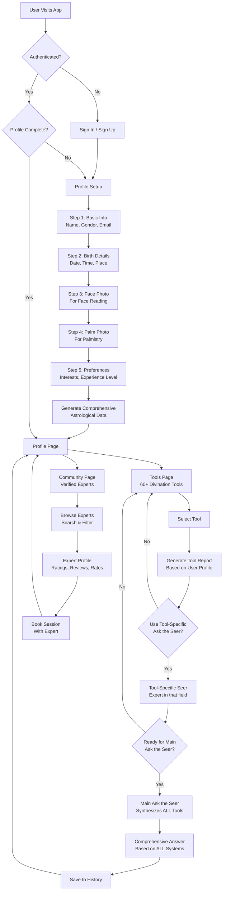
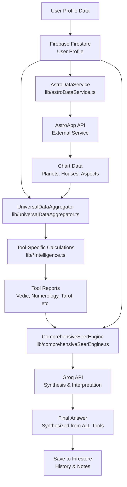

# FutureSeer Finale - Context Document

> **PURPOSE**: This document serves as the definitive reference for any agent working on FutureSeer. **ALWAYS READ THIS FILE FIRST** before making any changes to the codebase. This ensures continuity, prevents breaking changes, and maintains the app's vision and quality standards.

---

## Table of Contents

1. [App Overview & Vision](#app-overview--vision)
2. [Architecture & User Flow](#architecture--user-flow)
3. [Divination Tools Catalog](#divination-tools-catalog)
4. [Design System](#design-system)
5. [Technical Architecture](#technical-architecture)
6. [Conversational Memory System](#conversational-memory-system)
7. [Agent Guidelines](#agent-guidelines)
8. [Material 3 Integration Guide](#material-3-integration-guide)
9. [Common Patterns & Best Practices](#common-patterns--best-practices)

---

## App Overview & Vision

### What is FutureSeer?

FutureSeer is an AI-powered mystical insights platform that combines **ALL major occult and divination systems** to provide personalized predictions and guidance. The app uses ancient wisdom from multiple traditions, enhanced with modern AI, to help users understand their future, make decisions, and navigate life's challenges.

### Core Mission

**"To provide the most comprehensive, accurate, and personalized mystical insights by synthesizing all available divination and occult systems into a unified, intelligent prediction engine."**

### Key Principles

1. **Comprehensive Coverage**: The app integrates 60+ divination tools from various traditions (Astrology, Numerology, Tarot, Palmistry, etc.)
2. **Personalization**: Every reading is customized based on the user's complete profile (birth data, name, face image, palm image)
3. **AI Enhancement**: Modern AI synthesizes insights from all systems to provide coherent, actionable guidance
4. **Respectful Design**: Devotional/mystical styling that honors the sacred nature of these practices
5. **Smooth Experience**: Material 3 design principles ensure flawless performance on Android and iOS

### Core Features

FutureSeer's primary value comes from two core features:

1. **"Ask the Seer"** - The main attraction and most powerful feature
   - **Main "Ask the Seer"**: Synthesizes insights from ALL 60+ divination tools
   - **Tool-Specific "Ask the Seer"**: Expert consultations for each individual tool
   - Provides comprehensive, cross-validated predictions
   - Uses Groq AI for fast, intelligent synthesis
   - Available after users explore individual tools
   - This is the ultimate feature that combines all occult systems into one intelligent prediction engine

2. **Community Page** - Connect with verified mystics and experts
   - Browse and book sessions with certified experts
   - Search by specialty (Vedic Astrology, Tarot, Palmistry, etc.)
   - Expert verification system
   - Community-driven insights and discussions
   - 150+ active members, 25 verified experts
   - Real-time expert availability and booking
   - Community attribution and leaderboard

### Target User Experience

Users should feel:
- **Guided**: Clear path from signup to getting insights
- **Empowered**: Understand their cosmic blueprint and future possibilities
- **Respected**: Sacred traditions are honored, not commercialized
- **Confident**: Predictions are based on comprehensive analysis, not random guesses

---

## Architecture & User Flow

### Complete User Journey

The app follows a structured flow where users progressively build their mystical profile and access increasingly sophisticated insights. The journey culminates in two core features.

**Post sign-in / sign-up destinations:**
- **Returning user** (has signed in before): → **`/tools`**
- **New user**: → **`/profile`**
- If the URL has a valid `?redirect=...`, the user is sent there after auth.

**Flow:** Profile Setup (`/profile-setup`) → on completion goes to **`/profile`**. On the Profile page the user selects a plan and clicks "Generate my mystical profile"; then reports appear in Tools and the main Ask the Seer.

```
Sign In → (new: /profile | returning: /tools)
Profile Setup → /profile → Select plan → Generate mystical profile → Tools + Main "Ask the Seer" (CORE)
                                                                                ↓
                                                                      Community Page (CORE)
```

**Core Features Access:**
- **Main "Ask the Seer"**: Available at **`/ask-the-seer`** (redirects: `/ask`, `/seer`) - synthesizes ALL systems
- **Community Page**: Protected route - connect with verified experts anytime

### Detailed Flow Diagram



### Data Flow Architecture



### Key User Flow Points

1. **Profile Setup** (`app/profile-setup/page.tsx`)
   - **Required Fields**: Full Name, Gender, Birth Date, Birth Time, Birth Place
   - **Optional Fields**: Face Photo (for Face Reading), Palm Photo (for Palmistry)
   - **Outcome**: On completion, navigates to **`/profile`**
   - **"Complete profile" (birth data missing)**: Send users to **`/profile-setup`** to fill birth date/place.

2. **Profile Page** (`app/profile/page.tsx`) — **"Generate mystical profile / select plan"**
   - User must have birth date and birth place (`hasRequiredProfileSetup` in `lib/authRouting.ts`).
   - User selects a plan (required for generation unless on no-charge list), then clicks "Generate my mystical profile" → `POST /api/profile/generate-mystical`.
   - When profile is complete but generation not done (or plan not selected), link users here from Tools and Ask the Seer.

3. **Tools Exploration** (`app/tools/page.tsx`)
   - **`/tools`** is public. Authenticated users without required profile setup are client-side redirected to `/profile-setup`.
   - Users can browse 60+ divination tools; each tool shows a report from the comprehensive mystical profile (from Firestore `comprehensiveMysticalProfiles/{uid}`).
   - Tools are categorized: Astrology, Numerology, Divination, Reading, Analysis.

4. **Tool-Specific "Ask the Seer"**
   - Each tool has its own "Ask the Seer" feature (e.g., `/api/ask-vedic-seer`, `/api/ask-tarot-seer`)
   - These are experts in their specific field
   - They use data from that tool + user profile to answer questions

5. **Main "Ask the Seer"** — **Canonical page: `app/ask-the-seer/page.tsx` at `/ask-the-seer`**
   - **This is the main attraction** - synthesizes insights from ALL tools
   - **URLs**: `/ask` and `/seer` redirect to **`/ask-the-seer`**
   - **Chat API**: `/api/ask-the-seer` forwards to **`/api/seer/chat`** (not `/api/seer/query`)
   - Uses aggregated data from all divination systems; only works after user has profile and (optionally) generated reports

6. **Community Page** (`app/community/page.tsx`)
   - Connect with certified mystics, astrologers, and spiritual guides

7. **Ask the Seer Flow**
   - **Sign-in (returning user)**: → `/tools` (or `?redirect`). Then Ask the Seer, Tools, Community.
   - **Sign-up (new user)**: → `/profile`. Profile Setup (if needed) → Profile Page → Select plan → Generate mystical profile → Ask the Seer → Tools → Community
   - Returning users go to `/tools`, not Profile Setup (`isReturningUser()` in `lib/firebase.ts` — heuristic: lastSignInTime − creationTime > 60s)

8. **Profile Setup Styling**
   - Uses M3 design system, gradient cards, amber accents
   - Matches Profile and Dashboard styling

9. **Navigation**
   - Hamburger menu order: Home, Dashboard, Ask the Seer, Tools, Community, then rest
   - Avatar on dashboard: top-left
   - UserMenuDropdown: opens to the right (`left-0`)

10. **Mobile & Capacitor**
   - Viewport: `maximumScale: 1`, `userScalable: false` when `CAPACITOR_BUILD=1`
   - Safe-area insets: `env(safe-area-inset-*)` on body
   - Height units: `svh` (small viewport height) for modals and full-page layouts to avoid WebView address bar issues
   - Modal positioning: `fixed inset-0` with flex/grid centering (MysticalFeedback, TipJarModal, ShareAppModal)
   - Capacitor Keyboard plugin: `resize: "body"`, `resizeOnFullScreen: true`
   - Browse verified experts by specialty (Vedic Astrology, Tarot, Palmistry, etc.)
   - Search and filter experts by name, specialty, or description
   - View expert profiles: ratings, reviews, availability, hourly rates, certifications
   - Book sessions with verified experts
   - Apply to become a verified expert
   - Community stats: 150+ active members, 25 verified experts, 500+ sessions completed
   - Features: Expert verification badges, online status indicators, specialty badges, certifications display

### Stability and critical paths

For third-party users, stability and consistency depend on these paths:

1. **Auth + cookie**: Firebase Auth; client sets `fs_auth` cookie; middleware (or proxy) checks it for protected routes and redirects to `/signin?redirect=<path>` when missing.
2. **Profile completion and generate-mystical**: Profile setup → profile page → plan selection → `POST /api/profile/generate-mystical` → Firestore writes to `comprehensiveMysticalProfiles/{uid}`, `users/{uid}`, `seerMaster/{uid}`.
3. **Reports and plan gate**: `MysticalProfileContext` reads `comprehensiveMysticalProfiles/{uid}` (with cache and real-time listener). `ToolsProfileGate` blocks full tool content until the user has a plan (`canViewFullProfile`).
4. **Main and tool-specific Seer APIs**: Main chat uses `/api/ask-the-seer` → `/api/seer/chat`; tool pages call their `/api/ask-*-seer` endpoints with the user's comprehensive profile.

### Known risks and mitigations

| Risk | Mitigation |
|------|------------|
| **Returning-user heuristic** | `isReturningUser()` uses a 60s threshold; a new user who takes longer during OAuth could be sent to `/tools` with no profile. Consider treating "no Firestore profile or no `mysticalProfileGenerated`" as new and sending to `/profile`. |
| **Route protection** | Protected routes rely on the `fs_auth` cookie and proxy logic. If Next.js does not run the proxy as middleware, add `middleware.ts` that invokes it so unauthenticated users are redirected before content loads. |
| **Complete Profile link** | When profile is incomplete (missing birth data), "Complete Profile" should link to **`/profile-setup`**; when birth data exists but generation/plan is needed, link to **`/profile`**. Ask the Seer page uses this distinction. |
| **Generate-mystical partial failure** | API returns `failedTools`; partial success still writes to Firestore so the user sees what succeeded. Ensure error logging and user messages stay consistent for support. |
| **Plan gate / subscription state** | `canViewFullProfile` depends on plan or no-charge list. Webhook delays can gate users incorrectly; consider idempotent webhooks and a "Refresh plan status" on profile. |

---

## Divination Tools Catalog

### Complete List of Tools

FutureSeer integrates **60+ divination and occult systems**. Each tool requires specific profile data and generates personalized reports.

#### Astrology Tools (15+ systems)

| Tool | Required Data | API Endpoint | Ask the Seer |
|------|---------------|-------------|--------------|
| **Vedic Astrology** | Name, DOB, TOB, POB | `/api/tools/vedic/analysis` | `/api/ask-vedic-seer` |
| **Western Astrology** | Name, DOB, TOB, POB | `/api/tools/western-astrology/analysis` | `/api/ask-western-seer` |
| **KP Astrology** | Name, DOB, TOB, POB | `/api/tools/kp-astrology/analysis` | Built-in |
| **Horary Astrology** | Name, DOB, TOB, POB, Question | `/api/tools/horary-astrology/analysis` | Built-in |
| **Hellenistic Astrology** | Name, DOB, TOB, POB | `/api/tools/hellenistic-astrology/analysis` | Built-in |
| **Medical Astrology** | Name, DOB, TOB, POB | `/api/tools/medical-astrology/analysis` | Built-in |
| **Financial Astrology** | Name, DOB, TOB, POB | `/api/tools/financial-astrology/analysis` | `/api/ask-financial-seer` |
| **Mundane Astrology** | Name, DOB, TOB, POB | `/api/tools/mundane-astrology/analysis` | Built-in |
| **Synastry** | Name, DOB, TOB, POB + Partner Data | `/api/tools/synastry/analysis` | Built-in |
| **Electional Astrology** | Name, DOB, TOB, POB | `/api/tools/electional-astrology/analysis` | Built-in |
| **Lunar Astrology** | Name, DOB, TOB, POB | `/api/tools/lunar-astrology/analysis` | Built-in |
| **Fixed Star Astrology** | Name, DOB, TOB, POB | `/api/tools/fixed-star-astrology/analysis` | Built-in |
| **Bazi (Four Pillars)** | Name, DOB, TOB, POB | `/api/tools/bazi/analysis` | Built-in |
| **13 Signs Zodiac** | Name, DOB, TOB, POB | `/api/tools/13-signs-zodiac/analysis` | Built-in |

#### Numerology Tools (5+ systems)

| Tool | Required Data | API Endpoint | Ask the Seer |
|------|---------------|-------------|--------------|
| **Chaldean Numerology** | Full Name | Calculated | Built-in |
| **Kabbalistic Numerology** | Full Name | Calculated | Built-in |
| **Angel Numbers** | Full Name, DOB | Calculated | Built-in |
| **Name Analysis** | Full Name | Calculated | Built-in |
| **Vedic Astro-Numerology** | Name, DOB, TOB, POB | `/api/vedic-astro-numerology` | Built-in |

#### Divination Tools (10+ systems)

| Tool | Required Data | API Endpoint | Ask the Seer |
|------|---------------|-------------|--------------|
| **Tarot** | Full Name, Question (optional) | `/api/tools/tarot/reading` | `/api/ask-tarot-seer` |
| **Lenormand** | Full Name, Question | `/api/tools/lenormand/reading` | Built-in |
| **Runes** | Full Name, Question | `/api/tools/runes/reading` | Built-in |
| **I Ching** | Full Name, Question | `/api/tools/iching/reading` | `/api/ask-iching-seer` |
| **Pendulum** | Full Name, Question | `/api/tools/pendulum/reading` | Built-in |
| **Geomancy** | Full Name, Question | `/api/tools/geomancy/reading` | `/api/ask-geomancy-seer` |
| **Bibliomancy** | Full Name, Question | `/api/tools/bibliomancy/reading` | Built-in |
| **Scrying** | Full Name, Question | `/api/tools/scrying/reading` | Built-in |
| **Sortilege** | Full Name, Question | `/api/tools/sortilege/reading` | Built-in |
| **Ogham** | Full Name, Question | `/api/tools/ogham/reading` | Built-in |

#### Reading Tools (3+ systems)

| Tool | Required Data | API Endpoint | Ask the Seer |
|------|---------------|-------------|--------------|
| **Palmistry** | Full Name, Palm Photo, Gender | `/api/tools/palmistry/reading` | Built-in |
| **Face Reading** | Full Name, Face Photo | `/api/tools/face-reading/reading` | Built-in |
| **Dream Symbols** | Full Name, Dream Description | `/api/tools/dream-symbols/analysis` | Built-in |

#### Analysis Tools (5+ systems)

| Tool | Required Data | API Endpoint | Ask the Seer |
|------|---------------|-------------|--------------|
| **Vastu** | Full Name, DOB, Location | `/api/tools/vastu/analysis` | Built-in |
| **Feng Shui** | Full Name, DOB, Location | `/api/tools/feng-shui/analysis` | Built-in |
| **Human Design** | Name, DOB, TOB, POB | `/api/tools/human-design/analysis` | Built-in |
| **Energy Healing** | Full Name, DOB | `/api/tools/energy-healing/analysis` | `/api/ask-energy-healing-seer` |
| **Akashic Records** | Full Name, DOB, TOB, POB | `/api/tools/akashic-records/reading` | Built-in |

### Profile Data Requirements

**Minimum Required for Basic Tools:**
- `fullName`: Used for numerology, name analysis
- `birthDate`: Used for astrology, numerology calculations
- `gender`: Used for palmistry (right palm for men, left for women)

**Required for Advanced Tools:**
- `birthTime`: Essential for accurate astrological charts
- `birthPlace`: Required for precise astrological calculations (latitude/longitude)

**Optional but Recommended:**
- `facePhoto`: Enables Face Reading analysis
- `palmPhoto`: Enables Palmistry analysis (gender determines which palm)

### Tool Data Flow

```mermaid
graph LR
    Profile[User Profile] --> ToolSelector[Tool Selector<br/>lib/services/toolManager.ts]
    ToolSelector --> ToolConfig[Tool Config<br/>Required Fields Check]
    ToolConfig --> DataExtractor[Data Extractor<br/>lib/toolDataExtractor.ts]
    DataExtractor --> ToolIntelligence[Tool Intelligence<br/>lib/*Intelligence.ts]
    ToolIntelligence --> ToolReport[Tool Report<br/>Personalized Reading]
    ToolReport --> ToolSeer[Tool-Specific Seer<br/>Optional]
    ToolSeer --> UniversalAggregator[Universal Aggregator<br/>For Main Seer]
```



---

## Design System

### Current Design Philosophy

FutureSeer uses a **devotional/mystical design system** that honors the sacred nature of divination practices while providing a modern, smooth user experience.

### Platform-aware modes (desktop, Android mobile, iOS/macOS with Konsta)

The app uses **three** layout/design modes so that desktop, Android, and Apple devices (iOS, macOS) each get the right look without the user choosing anything. **Konsta UI** (free, MIT) supplies iOS and Material themes; Apple ID sign-in can also trigger Konsta iOS styling.

| Mode | When | Design language | Bottom nav |
|------|------|------------------|------------|
| **Devotionist (web)** | Viewport ≥ 768px and not macOS (e.g. Windows, Linux) | Transparent surfaces, Cinzel headings, starfield, no bottom nav | None (header nav) |
| **Material 3 (Android mobile)** | Viewport &lt; 768px and OS = Android (or Capacitor Android) | Solid M3 surfaces, **Konsta** `theme="material"`, bottom nav (Material style) | Yes – M3-style bar |
| **Konsta iOS (iOS / macOS / Apple ID)** | Viewport &lt; 768px and OS = iOS, **or** viewport ≥ 768px and macOS, **or** user signed in with **Apple ID** | **Konsta** `theme="ios"`, `k-ios` on body, iOS-style tab bar (translucent, blur, safe area) | Yes on mobile – iOS-style tab bar; no bottom nav on desktop |

**How it works:**

- **Layout** is still driven by viewport width (768px) and Capacitor: `platform-web` vs `platform-android` (see AGENTS.md).
- **Design system** (`data-design-system`): `lib/platformDetection.ts` exposes `getDesignSystem({ isMobile, mobileOS, isMacOS, signedInWithApple })` → `'devotionist' | 'material' | 'konsta-ios'`. **macOS** is detected via UA (Macintosh, not iPhone/iPad). **Apple ID**: when the user signed in with Apple (`providerId === 'apple.com'`), `signedInWithApple` is true and can force `konsta-ios` so Apple users get Konsta iOS styling even on non-Apple devices.
- **DesignSystemSync** (inside `AuthProvider`): Reads `data-platform` and `data-mobile-os`, gets `signedInWithApple` from the auth user, calls `getDesignSystem()`, and sets `data-design-system` and `data-apple-id` on `<html>`. Adds `k-ios` or `k-material` to `<body>` so Konsta CSS applies.
- **Konsta UI**: `KonstaThemeProvider` wraps the app with `KonstaProvider theme={data-design-system === 'konsta-ios' ? 'ios' : 'material'}`. Konsta theme CSS is imported in `globals.css` (`konsta/react/theme.css`).
- **Bottom nav**: When `data-mobile-os="ios"` **or** `data-design-system="konsta-ios"`, the nav uses class `bottom-nav-ios` and iOS styling (blur, safe area). Otherwise the Material 3 bar is used.
- **Floating widgets** (Tip Jar, Feedback): iOS/Konsta-ios uses the same bottom offsets as Android so they sit above the tab bar.

**References:** [Konsta UI](https://konstaui.com) (MIT), Apple [Human Interface Guidelines – Tab bars](https://developer.apple.com/design/human-interface-guidelines/tab-bars), [Optimizing for Safari](https://developer.apple.com/documentation/webkit/optimizing-your-website-for-safari).

### Accessibility

The app targets WCAG 2.1 AA where practical. Axe rules addressed to avoid audit loopholes: **button-name** (discernible text for icon buttons, e.g. feedback and tip jar triggers), **landmark-one-main** (single `<main>` in the root layout; tools layout uses a div), **color-contrast** (`--m3-on-primary` set for sufficient contrast on primary buttons), **aria-hidden-focus** (floating widgets use `tabIndex={-1}` when a modal is open). Viewport zoom is not disabled (`maximumScale` / `userScalable` not restricted).

### Color Scheme

**Primary Colors:**
- **Gold/Amber**: `#fbbf24` (amber-400) - Primary accent, buttons, highlights
- **Amber-500**: `#f59e0b` - Secondary buttons, hover states
- **Amber-300**: `#fcd34d` - Light accents, hover effects

**Background:**
- **Dark Navy**: `#141932` or `#0a0f1f` - Main background
- **Starfield Texture**: 8K UHD starfield image (`/assets/bg/starfieldn-8k.png`)
- **Glass Morphism**: `rgba(24, 26, 38, 0.7)` with `blur(12px)` backdrop

**Text Colors:**
- **Primary Text**: `text-white` or `text-slate-200`
- **Secondary Text**: `text-slate-300` or `text-slate-400`
- **Accent Text**: `text-amber-400` (gold glow effect)

**Forbidden Colors:**
- ❌ `orange` (use amber instead)
- ❌ `#ff6b6b`, `#4ecdc4` (don't use random bright colors)
- ❌ Light `slate` backgrounds (slate text colors are allowed)

### Typography

**Headings:**
- **Font**: `Cinzel` (serif) - Sacred, mystical feel
- **Weights**: 300 (light), 400 (regular), 600 (semi-bold), 700 (bold)
- **Letter Spacing**: `0.05em` for headings
- **Classes**: `.font-sacred-heading`, `.gold-glow` for main titles

**Body Text:**
- **Font**: `Inter` (sans-serif) - Modern, readable
- **Alternative**: `Cormorant Garamond` for sacred body text (`.font-sacred-body`)
- **Sizes**: Use Tailwind scale (`text-xs` to `text-5xl`)

### Component Styling

**Cards:**
```css
.glass-card {
  background: rgba(24, 26, 38, 0.7);
  backdrop-filter: blur(12px);
  border-radius: 1.5rem;
  border: 1.5px solid rgba(255, 255, 255, 0.12);
  box-shadow: 0 4px 32px 0 rgba(0,0,0,0.25);
}
```

**Buttons:**
- **Primary**: Amber/gold gradient (`bg-gradient-to-r from-amber-500 to-yellow-500`)
- **Secondary**: Glass morphism with amber border
- **Hover**: Slight lift (`translateY(-2px)`) with enhanced glow

**Tabs (Devotionist Style):**
```css
.devotionist-tab-trigger {
  /* Active: Gradient background, amber text */
  /* Inactive: Transparent, slate text, hover effect */
}
```

### Animations

**Principles:**
- **Smooth**: All transitions use `ease` or `cubic-bezier(0.4, 0, 0.2, 1)`
- **Subtle**: Animations enhance, don't distract
- **Performance**: Use `transform` and `opacity` for GPU acceleration
- **Accessibility**: Respect `prefers-reduced-motion`

**Key Animations:**
- **Gold Glow**: Text shadow animation on hover (`.gold-glow:hover`)
- **Card Hover**: Lift effect with border glow
- **Loading States**: Pulse or shimmer effects
- **Page Transitions**: Fade in/out with slight movement

### Background System

**Starfield Background:**
- **Class**: `.starfield-ultra-sharp` (applied to body)
- **Image**: `/assets/bg/starfieldn-8k.png` (8K UHD)
- **Rendering**: `image-rendering: crisp-edges` for sharp display
- **Performance**: Uses `::before` pseudo-element for filtered overlay

**Key CSS Variables:**
```css
:root {
  --starfield-image: url('/assets/bg/starfieldn-8k.png');
  --gold: #FFD700;
  --gold-gradient: linear-gradient(90deg, #FFD700 0%, #FFEF8F 100%);
  --glass-bg: rgba(24, 26, 38, 0.7);
  --glass-blur: blur(12px);
}
```

---

## Technical Architecture

### Route protection

Protected routes (`/profile`, `/profile-setup`, `/ask-the-seer`, `/community`, `/notes`, `/support`) are guarded by checking the `fs_auth` cookie (set client-side after Firebase auth in `hooks/use-auth.tsx`). The logic lives in `proxy.ts`; Next.js invokes it via `middleware.ts` at the project root so that unauthenticated users are redirected to `/signin?redirect=<path>` before protected content is served. Definitive auth still happens client-side via Firebase.

### Key Files & Their Purposes

#### Core Application Files

**`app/layout.tsx`**
- Root layout with global providers
- Error boundary setup
- Firestore error suppression
- Global styles and fonts

**`app/page.tsx`**
- Landing page
- Hero section with CTA
- Feature blocks

**`app/profile-setup/page.tsx`**
- Multi-step profile setup wizard
- Collects: Name, Gender, Birth Data, Photos, Preferences
- Generates astrological data after completion

**`app/dashboard/page.tsx`**
- User dashboard
- Daily insights preview
- Active remedies
- Prediction history
- Symbolic pattern highlights

**`app/tools/page.tsx`**
- Tools catalog page
- Lists all 60+ divination tools
- Categorized by type (Astrology, Numerology, etc.)

**`app/tools/[slug]/page.tsx`**
- Dynamic tool pages
- Tool-specific interface
- Report generation
- Tool-specific "Ask the Seer" integration

**`app/ask-the-seer/page.tsx`**
- Main "Ask the Seer" interface (canonical URL: **`/ask-the-seer`**)
- Chat interface for comprehensive questions; calls `/api/ask-the-seer` which forwards to `/api/seer/chat`
- Uses aggregated data from all tools

**`app/ask/page.tsx`** and **`app/seer/page.tsx`**
- Redirect to `/ask-the-seer`

**`app/community/page.tsx`**
- Community marketplace for verified mystics and experts
- Expert search and filtering by specialty, name, or description
- Expert application system for becoming a verified expert
- Session booking interface
- Community statistics display (members, experts, sessions, ratings)
- Expert profiles with ratings, reviews, availability, hourly rates

**`app/community/attribution/page.tsx`**
- User attribution and referral tracking
- Community member connections
- Discussion threads
- Contribution tracking and leaderboard

**`app/pricing/page.tsx`**
- Main pricing/contribution page
- Displays contribution tiers (Trial, Coffee, Treat, Hamper)
- Tip jar for one-time contributions
- Power user benefits section
- Attribution leaderboard preview

#### Core Library Files

**`lib/firebase.ts`**
- Firebase initialization
- Auth helpers
- Firestore helpers
- Storage helpers
- Error suppression for Firestore internal errors

**`lib/astroDataService.ts`**
- AstroApp API integration
- Chart data generation
- Comprehensive astrological data fetching
- Caching and optimization

**`lib/universalDataAggregator.ts`**
- Aggregates data from ALL divination tools
- Creates `UniversalDivinationData` object
- Used by main "Ask the Seer"

**`lib/comprehensiveSeerEngine.ts`**
- **Main prediction engine**
- Synthesizes insights from all tools
- Cross-system validation
- Timing predictions
- Confidence scoring

**`lib/conversationalMemory.ts`**
- **Conversational Memory System**
- Implements Working, Short-term, Long-term, Episodic, and Procedural memory
- Cross-session context loading and summarization
- Memory versioning and rollback capabilities
- Used by all seer API routes for context persistence
- Solves the "forgetting" issue between chat sessions

**`lib/toolDataMapper.ts`**
- Maps tool names to data sources
- Defines required data for each tool
- Data transformation functions

**`lib/services/toolManager.ts`**
- Tool configuration database
- Tool metadata (name, category, premium status, etc.)
- Required/optional fields per tool

**Tool Intelligence Files** (`lib/*Intelligence.ts`):
- `lib/vedicIntelligence.ts` - Vedic astrology interpretations
- `lib/westernAstrologyIntelligence.ts` - Western astrology
- `lib/numerologyIntelligence.ts` - Numerology calculations
- `lib/tarotIntelligence.ts` - Tarot interpretations
- `lib/palmistryIntelligence.ts` - Palmistry analysis
- `lib/faceReadingIntelligence.ts` - Face reading
- ... (one per tool)

#### API Routes

**`app/api/seer/query/route.ts`**
- Main "Ask the Seer" API endpoint
- Receives user question
- Aggregates all tool data
- Calls `ComprehensiveSeerEngine`
- Returns synthesized answer

**`app/api/ask-*-seer/route.ts`**
- Tool-specific "Ask the Seer" endpoints
- Examples: `ask-vedic-seer`, `ask-tarot-seer`, `ask-iching-seer`
- Expert in specific field
- Uses tool-specific data + user profile

**`app/api/tools/*/route.ts`**
- Tool-specific API endpoints
- Generate reports for individual tools
- Examples: `/api/tools/vedic/analysis`, `/api/tools/tarot/reading`

**`app/api/occult/universal/route.ts`**
- Universal occult service
- Supports multiple systems
- Fallback for tool-specific endpoints

#### Component Files

**`components/AskTheSeerChatInterface.tsx`**
- Main chat interface for "Ask the Seer"
- Streaming responses
- Conversation history
- Context management

**`components/AskTheSeerInterface.tsx`**
- Alternative interface (simpler)
- Used in some tool pages

**Tool Components** (`components/*Tool.tsx`, `components/*CoachInterface.tsx`):
- `components/VedicAstrologyTool.tsx`
- `components/TarotTool.tsx`
- `components/PalmistryTool.tsx`
- `components/BaZiCoachInterface.tsx`
- ... (one per tool)

**`components/header.tsx`**
- Main navigation header
- User menu
- Mobile navigation

**`components/MysticalBackground.tsx`**
- Starfield background component
- Mystical effects

**`components/FloatingTipJar.tsx`**
- Global floating Tip Jar button
- Available on all pages (bottom-right corner)
- Opens TipJarModal for one-time contributions
- Fixed positioning with proper z-index management

### Data Flow Patterns

#### Profile Data Flow

```
User Input → Profile Setup Form → Firebase Firestore → AstroDataService → AstroApp API → Chart Data → Universal Aggregator
```

#### Tool Report Generation

```
User Selects Tool → Tool Manager (check requirements) → Data Extractor → Tool Intelligence → Tool Report → Display to User
```

#### Main "Ask the Seer" Flow

```
User Question → /api/seer/query → Universal Aggregator (get all tool data) → ComprehensiveSeerEngine → Groq API → Synthesized Answer → Display
```

#### Tool-Specific "Ask the Seer" Flow

```
User Question → /api/ask-{tool}-seer → Tool Data + User Profile → Tool Intelligence + Groq → Tool-Specific Answer → Display
```

#### Conversational Memory Flow

```
User Question → ConversationalMemory (load recent context) → Enhanced AI Prompt (with cross-session context) → AI Response → Store Exchange → Auto-Summarize (if threshold reached) → Save Memory
```

### Firebase Integration

**Collections:**
- `users/{userId}` - User profile data
- `users/{userId}/charts` - Astrological chart data
- `users/{userId}/readings` - Tool reports and readings
- `users/{userId}/history` - Question/answer history
- `users/{userId}/notes` - User notes
- `users/{userId}/memory/longTerm` - Long-term memory (preferences, life events, patterns)
- `users/{userId}/memory/episodic` - Episodic memory (timeline, achievements)
- `users/{userId}/memory/procedural` - Procedural memory (learned patterns, optimal responses)
- `users/{userId}/memory/summaries/{summaryId}` - Conversation summaries for cross-session context
- `users/{userId}/memory/versions/{versionNumber}` - Memory version snapshots
- `users/{userId}/memory/versionHistory` - Version history tracking

**Security Rules:**
- Users can only read/write their own data
- Admin users have elevated permissions
- Public data (tool configs) are readable by all

### External APIs

**AstroApp API:**
- Purpose: Generate accurate astrological charts
- Used by: `lib/astroDataService.ts`
- Data: Planets, houses, aspects, transits

**Groq API:**
- Purpose: Synthesize insights, generate interpretations (fast, high-quality responses)
- Used by: `ComprehensiveSeerEngine`, tool-specific seers
- Models: llama-3.3-70b-versatile (via AI Gateway or direct Groq)
- Key Files: `lib/aiGateway.ts`, `lib/vedicInterpretationEnhancer.ts`
- Performance: 500+ tokens/second streaming responses
- API Keys: `GROQ_API_KEY` or `AI_GATEWAY_API_KEY` (supports both)

---

## Conversational Memory System

### Overview

The Conversational Memory System solves the "forgetting" issue where AI agents lose context between chat sessions. It implements a comprehensive memory architecture with cross-session context loading, automatic summarization, and versioning capabilities.

**Key File**: `lib/conversationalMemory.ts`

### Memory Architecture

The system implements five types of memory following cognitive psychology principles:

1. **Working Memory** - Current session context (last 5 exchanges)
2. **Short-Term Memory** - Session-specific data (concerns, goals, mood, recent questions)
3. **Long-Term Memory** - Persistent user data (life events, question patterns, preferences, outcomes)
4. **Episodic Memory** - Timeline of events (achievements, life changes, spiritual journey)
5. **Procedural Memory** - Learned patterns and optimal responses

### Core Features

#### Context Summarization

- **Auto-Summarization**: Conversations are automatically summarized after 10 exchanges (configurable)
- **AI-Powered Summaries**: Uses AI Gateway to generate concise summaries with:
  - Key topics discussed
  - Key insights provided
  - Question types covered
  - Overall sentiment
- **Storage**: Summaries stored in Firestore at `users/{userId}/memory/summaries/{summaryId}`
- **Methods**: `summarizeContext()`, `generateAISummary()`, `addContextSummary()`, `getRecentSummaries()`, `autoSummarize()`

#### Context Versioning

- **Automatic Versioning**: Memory versions created automatically on significant changes:
  - Preference updates
  - Life events added
  - Major procedural memory updates
- **Rollback Capability**: Can rollback to previous memory versions
- **Storage**: Versions stored in Firestore at `users/{userId}/memory/versions/{versionNumber}`
- **Methods**: `createVersion()`, `getVersion()`, `rollbackToVersion()`, `getVersionHistory()`
- **Configuration**: Keeps last 20 versions by default (configurable)

#### Cross-Session Context Loading

- **Automatic Loading**: When initializing memory, automatically loads last 3-5 session summaries
- **Context Generation**: `getCrossSessionContext()` generates rich context string from:
  - Recent session summaries
  - Long-term memory (preferences, question patterns)
  - Episodic memory highlights (recent achievements)
- **Integration**: Used in all seer API routes to provide context-aware responses
- **Methods**: `loadRecentContext()`, `getCrossSessionContext()`, `initializeAllMemory(loadRecentContext: boolean)`

### Integration Across API Routes

All seer API routes use the unified ConversationalMemory system:

- `app/api/seer/query/route.ts` - Main "Ask the Seer"
- `app/api/ask-vedic-seer/route.ts` - Vedic astrology seer
- `app/api/ask-western-seer/route.ts` - Western astrology seer
- `app/api/ask-financial-seer/route.ts` - Financial astrology seer
- `app/api/ask-geomancy-seer/route.ts` - Geomancy seer
- `app/api/ask-iching-seer/route.ts` - I Ching seer
- `app/api/ask-numerology-seer/route.ts` - Numerology seer
- `app/api/hellenistic/ask-seer/route.ts` - Hellenistic astrology seer

**Pattern Used**:
1. Initialize ConversationalMemory with `initializeAllMemory(true)` to load recent context
2. Get conversation history from working memory
3. Use cross-session context in AI prompts
4. Store exchanges using `addExchange()` (auto-summarizes at threshold)
5. Save memory with `saveAllMemory()`
6. Maintain backward compatibility with old storage format

### Configuration

**MemoryConfig Interface**:
```typescript
{
  autoSummarizeThreshold: number;      // Default: 10 exchanges
  maxSummariesToLoad: number;          // Default: 5
  maxVersionsToKeep: number;           // Default: 20
  enableVersioning: boolean;           // Default: true
  enableAutoSummarization: boolean;    // Default: true
}
```

### Firestore Structure

**New Collections**:
```
users/{userId}/memory/
  ├── longTerm (existing)
  ├── episodic (existing)
  ├── procedural (existing)
  ├── summaries/
  │   └── {summaryId} (new)
  ├── versions/
  │   └── {versionNumber} (new)
  └── versionHistory (new)
```

### Utility Methods

- `getMemoryStats()` - Get memory statistics
- `clearOldSummaries(olderThanDays)` - Cleanup old summaries
- `exportMemory()` - Export memory for backup
- `importMemory(data)` - Import memory from backup

### Usage Example

```typescript
// Initialize memory with cross-session context
const memory = new ConversationalMemory(userId);
await memory.initializeAllMemory(true); // Load recent summaries

// Get cross-session context for AI prompts
const crossSessionContext = await memory.getCrossSessionContext();

// Add exchange (auto-summarizes at threshold)
await memory.addExchange(userMessage);
await memory.addExchange(seerMessage);

// Save all memory
await memory.saveAllMemory();
```

### Benefits

1. **Solves "Forgetting" Issue**: Context persists across chat sessions
2. **Efficient Storage**: Summaries reduce storage while preserving key information
3. **Version Control**: Can track and rollback memory changes
4. **Unified System**: All seer routes use the same memory system
5. **Backward Compatible**: Old storage format maintained for compatibility

### Important Notes for Agents

- **Always use ConversationalMemory** for new conversation storage
- **Initialize with `initializeAllMemory(true)`** to load cross-session context
- **Use `getCrossSessionContext()`** to enhance AI prompts with previous context
- **Auto-summarization happens automatically** - no manual intervention needed
- **Versioning is automatic** on significant changes - no manual version creation needed
- **Backward compatibility maintained** - old storage functions still work but are deprecated

### Related Documentation

- Implementation: `lib/conversationalMemory.ts`
- Research: `docs/GITHUB_COPILOT_SDK_RESEARCH.md`
- Integration: All `app/api/ask-*-seer/route.ts` files

---

### Pricing Strategy

**Model**: Contribution-based innovation support (not traditional subscription)

**Tiers:**
1. **Power User Trial** - Free 30-day trial
   - Full access to all tools
   - Early adopter status
   - Attribution on leaderboard
   - Part of the innovation team

2. **Coffee** (Monthly) - "Buy Me a Coffee"
   - Monthly recurring contribution
   - All 60+ divination tools
   - Unlimited AI readings
   - Priority AI responses
   - Community participation
   - Forever on leaderboard

3. **Treat** (Quarterly) - "Treat Me"
   - Quarterly contribution (better value)
   - All monthly benefits
   - Early access to new features
   - Priority support
   - 3 months of innovation support

4. **Hamper** (Annual) - "Buy a Festive Hamper"
   - Annual contribution (best value)
   - All quarterly benefits
   - Family account options
   - VIP community access
   - Influence on product roadmap
   - 12 months of innovation support

5. **Tip Jar** - One-time contribution (any amount, any time)
   - Show appreciation at any time
   - Support innovation with any amount you choose
   - No recurring commitment
   - Available anytime - contribute whenever you feel moved to support
   - Flexible contribution model - give what feels right
   - **Global Access**: Floating Tip Jar button available on all pages (bottom-right corner)
   - Quick access from anywhere in the app via floating heart button

**Pricing Principles:**
- **Value-based pricing**: Contributions support innovation, not just access
- **Multiple tiers**: Clear value progression from free to annual
- **Country-specific pricing**: Adjusted for India, Pakistan, Bangladesh, and other regions
- **Psychological pricing**: Framed as "contributions" and "support" rather than subscriptions
- **Anchor pricing**: Annual tier shows best value compared to monthly
- **Innovation focus**: Emphasizes supporting the innovation experiment

**Key Files:**
- `app/pricing/page.tsx` - Main pricing page
- `components/ContributionTiers.tsx` - Tier display component
- `lib/pricingConfig.ts` - Country-based pricing configuration
- `components/TipJarCard.tsx` - One-time contribution component
- `components/PowerUserBenefits.tsx` - Benefits display component

---

## Agent Guidelines

### Before Making Any Changes

1. **Read This File First**: Understand the app's purpose, architecture, and design principles
2. **Check User Rules**: Review `.cursor/rules` for project-specific guidelines
3. **Understand the Flow**: Know how data flows from profile → tools → seers
4. **Preserve Functionality**: Don't break existing features
5. **Enhance, Don't Replace**: Build upon existing systems

### What to Preserve

**Critical Systems (DO NOT BREAK):**
- ✅ Profile setup flow (`app/profile-setup/page.tsx`)
- ✅ AstroDataService integration (`lib/astroDataService.ts`)
- ✅ ComprehensiveSeerEngine (`lib/comprehensiveSeerEngine.ts`)
- ✅ Universal data aggregation (`lib/universalDataAggregator.ts`)
- ✅ Firebase authentication and data storage
- ✅ Tool-specific "Ask the Seer" endpoints
- ✅ Main "Ask the Seer" endpoint (`/api/seer/query`)

**Design Elements (MAINTAIN CONSISTENCY):**
- ✅ Gold/amber color scheme
- ✅ **CRITICAL**: Devotionist styling (MANDATORY for all tool pages)
- ✅ Starfield background
- ✅ Glass morphism cards (glass-card class)
- ✅ Sacred typography (Cinzel for headings)
- ✅ Material 3 components (enhance devotionist styling)

### What to Enhance

**Material 3 Integration:**
- ✅ Add Material 3 components where appropriate
- ✅ Improve animations (smooth, bouncy, responsive)
- ✅ Enhance micro-interactions
- ✅ Optimize for Android and iOS
- ✅ Improve pull-to-refresh animations
- ✅ Add floating action button animations

**Performance:**
- ✅ Optimize image loading
- ✅ Reduce API calls (use caching)
- ✅ Improve page load times
- ✅ Optimize animations (use GPU acceleration)

**User Experience:**
- ✅ Clearer navigation
- ✅ Better error messages
- ✅ Loading states
- ✅ Empty states
- ✅ Onboarding improvements

### Common Pitfalls to Avoid

**❌ DON'T:**
- Delete or rename critical files without understanding dependencies
- Change the color scheme to non-amber/gold colors
- Remove the starfield background
- Break the profile setup flow
- Modify `ComprehensiveSeerEngine` without understanding the full system
- Add new tools without updating `toolManager.ts` and `toolDataMapper.ts`
- Create duplicate functionality (check if it exists first)
- Use external APIs unnecessarily (prefer existing data)
- Break Firebase security rules
- Remove error handling or logging

**✅ DO:**
- Test changes in isolation first
- Check for existing similar functionality
- Follow the existing code patterns
- Use TypeScript types properly
- Add error handling
- Update documentation if adding features
- Consider mobile responsiveness
- Optimize for performance
- Maintain accessibility standards

### Making Changes Safely

**Step-by-Step Process:**

1. **Understand the Change**
   - What needs to be changed?
   - Why is the change needed?
   - What are the dependencies?

2. **Check Existing Code**
   - Search for similar functionality
   - Check related files
   - Understand data flow

3. **Plan the Change**
   - List files that need modification
   - Identify potential breaking points
   - Plan testing approach

4. **Make Minimal Changes**
   - Change only what's necessary
   - Preserve existing functionality
   - Add, don't replace

5. **Test Thoroughly**
   - Test the specific change
   - Test related functionality
   - Test on mobile devices

6. **Document if Needed**
   - Update this file if architecture changes
   - Add comments for complex logic
   - Update README if user-facing

### Code Style Guidelines

**TypeScript:**
- Use strict typing
- Define interfaces for data structures
- Use enums for constants
- Avoid `any` type

**React:**
- Use functional components
- Use hooks properly
- Optimize re-renders (use `useMemo`, `useCallback`)
- Handle loading and error states

**Styling:**
- Use Tailwind CSS classes
- Follow existing color scheme
- Use glass morphism for cards
- Maintain responsive design

**File Organization:**
- Keep related code together
- Use clear file names
- Group by feature, not by type
- Follow Next.js 15 app directory structure

---

## Material 3 Integration Guide

### What is Material 3?

Material 3 (Material You) is Google's latest design system that emphasizes:
- **Dynamic Color**: Adaptive color schemes based on user preferences
- **Expressive Design**: Smooth animations, micro-interactions
- **Accessibility**: Better contrast, larger touch targets
- **Performance**: Optimized animations, smooth scrolling

### Why Integrate Material 3?

Based on the [Android Authority article](https://www.androidauthority.com/android-app-design-3631537/), Material 3 provides:
- **Smooth Animations**: Bouncy, responsive interactions
- **Better Performance**: Optimized for Android and iOS
- **Modern Feel**: Users expect smooth, polished apps
- **Free & Open Source**: No licensing costs

### Integration Strategy

**Phase 1: Core Components**
1. Replace basic buttons with Material 3 FAB (Floating Action Button)
2. Add Material 3 pull-to-refresh animation
3. Implement Material 3 card components
4. Add smooth page transitions

**Phase 2: Animations**
1. Add micro-animations to charts and graphs
2. Implement bouncy button animations
3. Add smooth scroll indicators
4. Enhance loading states

**Phase 3: Advanced Features**
1. Dynamic color theming (while maintaining gold/amber accent)
2. Adaptive layouts
3. Enhanced accessibility
4. Performance optimizations

### Material 3 Components to Use

**Floating Action Button (FAB):**
```tsx
// Example: Add to dashboard or tools page
<FAB
  icon={<Sparkles />}
  onClick={handleAskSeer}
  extended={!isScrolled}
  // Bouncy animation on scroll
/>
```

**Pull-to-Refresh:**
```tsx
// Use Material 3 pull-to-refresh animation
// Smooth, circular progress indicator
```

**Cards:**
```tsx
// Material 3 cards with elevation
// Smooth shadow transitions
// Ripple effects on interaction
```

**Charts & Graphs:**
```tsx
// Animated chart rendering
// Smooth transitions between data points
// Micro-animations on hover
```

### Design Principles from Android Authority Article

**Key Takeaways:**
1. **Smooth Animations**: Every interaction should feel fluid
2. **Micro-Interactions**: Small details add up (button states, hover effects)
3. **Performance First**: No lag, instant feedback
4. **Information Hierarchy**: Clear visual hierarchy with proper spacing
5. **Accessibility**: Large touch targets, clear contrast

**Implementation:**
- Use `framer-motion` for smooth animations (already in dependencies)
- Implement Material 3 animation curves
- Add loading states with smooth transitions
- Optimize for 60fps animations

### Maintaining Devotional Styling

**CRITICAL**: Devotionist styling is **MANDATORY** for all tool pages. Material 3 should **enhance**, not replace the devotional/mystical styling. The combination of devotionist styling with Material 3 components creates the unique FutureSeer aesthetic.

**How to Balance:**
- Use Material 3 for **interactions** (animations, transitions, elevation)
- **REQUIRE**: Devotionist styling for tabs, cards, and UI elements
- Keep **gold/amber** color scheme
- Maintain **sacred typography** (Cinzel for headings)
- Preserve **starfield background**
- Use Material 3 **components** with mystical styling

**Example:**
```tsx
// Material 3 FAB with gold/amber styling
<FAB
  className="bg-gradient-to-r from-amber-500 to-yellow-500"
  icon={<Sparkles className="text-white" />}
  // Material 3 animation, mystical styling
/>
```

### Devotionist Styling Requirements

**CRITICAL**: Devotionist styling is **MANDATORY** for all tool pages. This is not optional - it is a core requirement of the FutureSeer design system.

#### Tab Styling (REQUIRED)

All tool pages **MUST** use devotionist tab styling:

**Active Tab State:**
- Background: `bg-gradient-to-br from-amber-100 to-yellow-100`
- Text: `text-amber-900`
- Elevation: `m3-elevation-1` (Material 3 elevation)
- Transitions: `m3-elevation-transition m3-transition-standard`

**Inactive Tab State:**
- Text: `text-slate-300`
- Hover: `hover:text-slate-100 hover:bg-slate-800/30`
- Elevation: `m3-elevation-0`

**Example:**
```tsx
<TabsTrigger 
  value="overview"
  className="m3-elevation-0 m3-elevation-transition m3-transition-standard data-[state=active]:m3-elevation-1 data-[state=active]:bg-gradient-to-br data-[state=active]:from-amber-100 data-[state=active]:to-yellow-100 data-[state=active]:text-amber-900 text-slate-300 hover:text-slate-100 hover:m3-elevation-1 hover:bg-slate-800/30 rounded-xl px-3 py-2 text-xs sm:text-sm m3-label-medium"
>
  Overview
</TabsTrigger>
```

#### Card Styling (REQUIRED)

All cards **MUST** use either:
1. `glass-card` class (preferred) - provides `rgba(24, 26, 38, 0.7)` background with `blur(12px)`
2. `DevotionistStyleCard` component for special cards

**Card Requirements:**
- Use `glass-card` class OR devotionist styling pattern
- Material 3 elevation props (`elevation={1}` or `elevation={2}`)
- Amber borders: `border-amber-500/30` or `border-amber-400/70`
- Rounded corners: `rounded-xl` or `rounded-2xl`

**Example:**
```tsx
<Card elevation={2} className="glass-card border-amber-500/30">
  {/* Card content */}
</Card>
```

#### Why Devotionist Styling is Critical

1. **Brand Identity**: The golden gradient (amber-100 to yellow-100) creates the "devotional" golden glow that is central to FutureSeer's mystical aesthetic
2. **User Experience**: The combination of devotionist styling with Material 3 creates a unique, premium feel that honors the sacred nature of divination practices
3. **Consistency**: All tool pages must follow the same devotionist pattern for a cohesive experience
4. **Differentiation**: This styling sets FutureSeer apart from generic astrology apps

**Remember**: Material 3 enhances devotionist styling - it never replaces it. Both are required.

### Material 3 Resources

- **Official Docs**: https://m3.material.io/
- **Material Design Components**: https://mui.com/material-ui/
- **React Material 3**: Use `@mui/material` or similar
- **Animation Guidelines**: Follow Material 3 motion principles

---

## Common Patterns & Best Practices

### Adding a New Tool

1. **Update Tool Manager** (`lib/services/toolManager.ts`)
   - Add tool config with required fields
   - Set premium status, category, icon

2. **Create Tool Intelligence** (`lib/*Intelligence.ts`)
   - Create intelligence file for calculations
   - Implement interpretation logic

3. **Create Tool Page** (`app/tools/[slug]/page.tsx`)
   - Use existing tool page template
   - Integrate tool intelligence
   - Add "Ask the Seer" if needed

4. **Update Tool Data Mapper** (`lib/toolDataMapper.ts`)
   - Add tool to mapping
   - Define data requirements
   - Add transformation functions

5. **Update Universal Aggregator** (`lib/universalDataAggregator.ts`)
   - Add tool data extraction
   - Include in comprehensive profile

### Adding a Tool-Specific "Ask the Seer"

1. **Create API Route** (`app/api/ask-{tool}-seer/route.ts`)
   - Use existing seer routes as template
   - Integrate tool intelligence
   - Add Groq synthesis (via AI Gateway or direct Groq)

2. **Update Tool Page**
   - Add "Ask the Seer" button
   - Integrate chat interface
   - Handle streaming responses

### Error Handling Patterns

```typescript
// Always handle errors gracefully
try {
  const result = await someOperation();
  return { success: true, data: result };
} catch (error) {
  console.error('Operation failed:', error);
  return { 
    success: false, 
    error: error instanceof Error ? error.message : 'Unknown error' 
  };
}
```

### Loading States

```tsx
// Always show loading states
{isLoading ? (
  <Skeleton className="h-20 w-full" />
) : (
  <Content />
)}
```

### Empty States

```tsx
// Provide helpful empty states
{data.length === 0 ? (
  <EmptyState 
    icon={<Sparkles />}
    title="No readings yet"
    description="Generate your first reading to see it here"
  />
) : (
  <DataList data={data} />
)}
```

### Caching Patterns

```typescript
// Cache expensive operations
const cachedData = await getCachedData(userId);
if (cachedData) {
  return cachedData;
}
const freshData = await generateData();
await setCachedData(userId, freshData);
return freshData;
```

---

## Troubleshooting

### Common Issues

**Profile Setup Not Working:**
- Check Firebase authentication
- Verify AstroApp API key
- Check browser console for errors
- Ensure all required fields are filled

**Tool Reports Not Generating:**
- Verify user profile is complete
- Check tool-specific requirements
- Review API endpoint logs
- Check tool intelligence file

**"Ask the Seer" Not Responding:**
- Check Groq API key (`GROQ_API_KEY`) or AI Gateway key (`AI_GATEWAY_API_KEY`)
- Verify universal data aggregation
- Review ComprehensiveSeerEngine logs
- Check Firebase data structure
- Verify Groq API is accessible and responding

**Design Issues:**
- Verify Tailwind config
- Check CSS variables
- Ensure starfield image exists
- Review component styling

### Debugging Tips

1. **Check Browser Console**: Look for errors or warnings
2. **Review Network Tab**: Check API calls and responses
3. **Inspect Firebase**: Verify data structure in Firestore
4. **Test in Isolation**: Isolate the problematic feature
5. **Check Dependencies**: Ensure all packages are installed

---

## Conclusion

This document serves as the **single source of truth** for FutureSeer. Any agent working on the codebase should:

1. **Read this file first** before making changes
2. **Understand the architecture** and data flow
3. **Preserve existing functionality** while enhancing
4. **Follow design principles** (devotional + Material 3)
5. **Test thoroughly** before considering changes complete

**Remember**: FutureSeer is a comprehensive mystical insights platform. Every change should maintain the integrity of the system while improving the user experience.

---

**Last Updated**: 2024
**Version**: 1.0
**Maintained By**: FutureSeer Development Team
