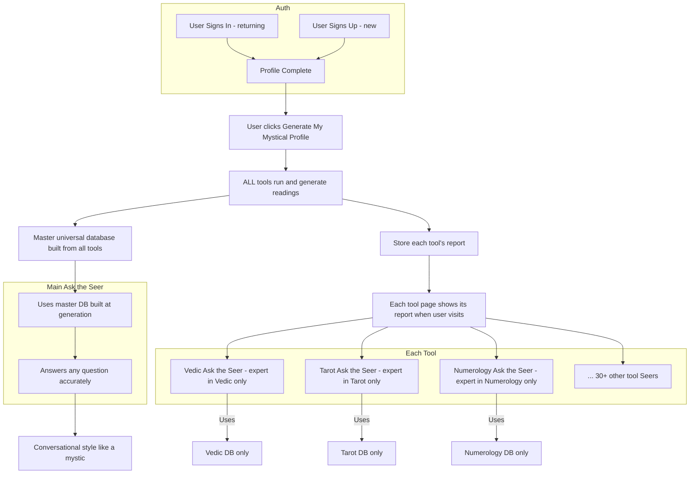

# Shared Understanding: FutureSeer Seer Architecture

## Your Vision (as I understand it)




---

## Alignment Summary


| Aspect                            | Your Vision                                                                                                                | Current State (from codebase)                                                                                                                                                |
| --------------------------------- | -------------------------------------------------------------------------------------------------------------------------- | ---------------------------------------------------------------------------------------------------------------------------------------------------------------------------- |
| **1. Profile generation**         | User clicks "Generate my mystical profile" → **all tools** run and generate readings immediately                           | Profile page generates Vedic-focused data first. Other tools may be generated on-demand when user visits each tool page. **Gap:** need all tools to run at generation time.  |
| **2. Report per tool**            | Report shown "in that specific tool"                                                                                       | Each tool page (e.g. Vedic, Tarot) fetches/displays its report. Vedic has `ComprehensiveVedicReport`. Some tools may need profile data to be populated first.                |
| **3. Tool-specific Ask the Seer** | Each tool has an expert that **only** uses that tool's database                                                            | Yes. Each tool has `*SeerChatInterface` and `/api/ask-*-seer` routes. They are intended to use only that tool's data (e.g. `VedicSeerChatInterface`, `ask-vedic-seer`).      |
| **4. Main Ask the Seer**          | Master DB built **at generation time** from **all tools** → answers any question accurately in mystic conversational style | `universalDataAggregator` builds `UniversalDivinationData` from comprehensive profile. **Gap:** ensure it pulls from all tool readings generated at profile generation time. |
| **5. Accurate answers**           | No matter what they ask, an accurate answer is given                                                                       | Engine routes by question type (purpose, career, remedy, timing, etc.). Remedy routing was recently fixed (mudra/color/gemstone). Some routing gaps may remain.              |


---

## Where We Are Aligned

- **Tool-specific Seers**: Each tool has its own Ask the Seer expert scoped to that tool's domain.
- **Main Seer**: Aggregates from all tools into a universal database and answers broadly.
- **Mystic conversational style**: Conversation layer adds reflection, softening, anchors, prompts.
- **Profile-first**: User must have a complete profile before generating mystical profile.

---

## Confirmed Requirements

1. **All tools generate a reading** — At profile generation time, every tool (Vedic, Tarot, Numerology, Face Reading, etc.) runs and produces its reading. No on-demand generation when visiting a tool.
2. **Each tool page shows its report when the user visits it** — The report is already generated; the tool page displays it when the user visits.
3. **Main Ask the Seer has comprehensive data at generation time** — The master universal database is built from all tool readings at generation time. The main Seer can answer any question immediately using this comprehensive data.

---

## Target Flow

```
User clicks "Generate My Mystical Profile"
    → Run ALL tools (Vedic, Tarot, Numerology, Face Reading, Palmistry, etc.)
    → Store each tool's reading in comprehensive profile
    → Build master universal database from all tool readings
    → Mark profile as generated

User visits Vedic tool page     → Shows Vedic report (already generated)
User visits Tarot tool page    → Shows Tarot report (already generated)
...

User asks Main Ask the Seer    → Uses master universal database (comprehensive, all tools)
```

---

## Implementation Tasks (when ready)

1. **Profile generation** (`app/profile/page.tsx`): Extend "Generate My Mystical Profile" to invoke all tool engines (Tarot, Numerology, Face Reading, Palmistry, etc.), not just Vedic.
2. **Store tool readings**: Ensure each tool's output is stored in the comprehensive profile / Firebase structure used by tool pages.
3. **Universal data aggregator** (`lib/universalDataAggregator.ts`): Ensure it receives and aggregates data from all tool readings generated at profile generation time.
4. **Tool pages**: Confirm each tool page reads its report from the comprehensive profile (pre-populated at generation) and displays it when visited.

---

## One-Line Verdict

**We are aligned.** All tools generate at profile generation; each tool page shows its report on visit; Main Ask the Seer uses a comprehensive master database built at generation time from all tools.