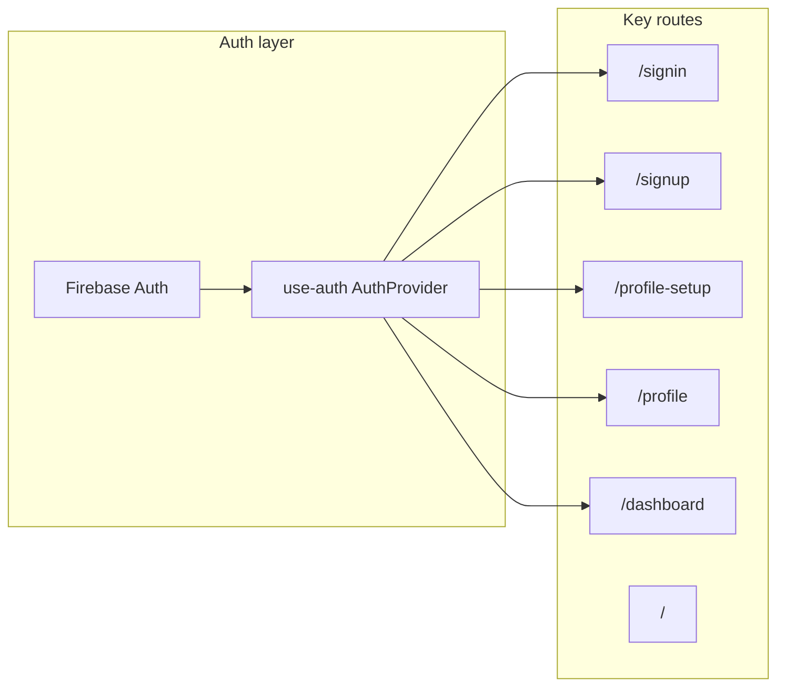

# Auth and Routing Flow Map

For a compact reference (traced flows table, route transitions by user type, navigation triggers), see [AUTH_AND_ROUTING_SUMMARY.md](AUTH_AND_ROUTING_SUMMARY.md).

## 1. Architecture overview

- **Auth provider**: [hooks/use-auth.tsx](../hooks/use-auth.tsx) wraps the app and exposes `user`, `userProfile`, `loading`, `signIn`, `signOut`, `refreshProfile`, and admin flags. It uses Firebase `onAuthStateChanged` and, on init, `getRedirectResult()` then loads profile via `getUserProfile(uid)`.
- **No Next.js middleware**: There is no `middleware.ts`; protection is done **per-page** with `useEffect` guards that call `router.push(...)` when the user is missing.
- **Returning vs new user**: [lib/firebase.ts](../lib/firebase.ts) exports `isReturningUser(user)`: `lastSignInTime - creationTime > 60000` (ms) ⇒ returning user.

---

## 2. Login flow

| Entry | After success | Where |
| ----- | ------------- | ----- |
| **Sign-in page** ([app/signin/page.tsx](../app/signin/page.tsx)) | | |
| Google | Returning → `/dashboard`, new → `/profile-setup`; or `?redirect=` if present (safe path only) | `handleGoogleSignIn`: uses `isReturningUser(user)`; `next = redirectTo ?? (returning ? "/dashboard" : "/profile-setup")`; `router.push(next)`. |
| Email | `/dashboard` or `?redirect=` if present | `handleSubmit`: `next = redirectTo ?? "/dashboard"`; `router.push(next)`. |
| **AuthModal** ([components/auth/AuthModal.tsx](../components/auth/AuthModal.tsx)) | | |
| Google | Returning → `/dashboard`, new → `/profile-setup` | `router.push(returning ? '/dashboard' : '/profile-setup')` (line 57). Uses `isReturningUser(user)`. |
| Email sign-in | Always → `/dashboard` | `router.push('/dashboard')` (line 102). |

**Note**: The sign-in page reads `redirect` from `useSearchParams()` and uses it when safe (path must start with `/` and not `//`). AuthModal is **not currently imported or used** anywhere else in the app; entry points use `/signin` and `/signup` (e.g. [hero-section.tsx](../components/hero-section.tsx)).

---

## 3. Signup flow

| Entry | After success | Where |
| ----- | ------------- | ----- |
| **Sign-up page** ([app/signup/page.tsx](../app/signup/page.tsx)) | | |
| Google | Returning → `/dashboard`, new → `/profile-setup` | `router.push(returning ? "/dashboard" : "/profile-setup")` (line 69). Uses `isReturningUser(user)`. |
| Email (SignupFlow) | Always → `/profile-setup` | `router.push("/profile-setup")` (line 176). |
| **AuthModal** | | |
| Email sign-up | → `/profile-setup` | `router.push('/profile-setup')` (line 142). |

---

## 4. Profile completion flow (new user)

- **Route**: [app/profile-setup/page.tsx](../app/profile-setup/page.tsx).
- **Guard**: `useEffect`: if `!user` → `router.push('/signin')` (lines 112–116). No redirect when profile already exists; page can be used to complete or edit.
- **On complete**: `handleComplete` saves profile (and may call AstroApp API), then `router.push('/profile')` (line 247).

---

## 5. Profile edit flow (existing user)

- **Route**: [app/profile/page.tsx](../app/profile/page.tsx).
- **Guard**: `useEffect`: if `!authLoading && !user` → `router.push("/signin")` (lines 281–284). If `!user` after loading, render returns `null` (lines 711–713) while the effect performs the redirect.
- **Save**: `handleSave` updates profile and stays on `/profile` (no navigation).
- **Generate mystical profile**: On success → `router.push(RETURNING_USER_WITH_REPORTS_DESTINATION)` (typically `/ask-the-seer`; see [lib/authRouting.ts](../lib/authRouting.ts)).

---

## 6. Logout flow

- **Triggers**: Profile page `handleSignOut` or [UserMenuDropdown](../components/UserMenuDropdown.tsx) `handleSignOut` both call `signOut()` from `useAuth()`.
- **Implementation**: [hooks/use-auth.tsx](../hooks/use-auth.tsx) `signOut` clears `userProfile` then calls `signOutUser()` from [lib/firebase.ts](../lib/firebase.ts). `signOutUser` (lines 1012–1039):
  - Calls Firebase `signOut(auth)`
  - Clears local data (`clearLocalData`, `profileCache.clear`, `clearAstroDataCache('all')`)
  - Sets `window.location.href = '/'` (full reload to home).

So logout **always** does a full page reload to `/`, not `router.push`.

---

## 7. Route transitions by user type

| User type | Typical path |
| --------- | ------------- |
| **Returning** (Google) | Sign-in or sign-up → `/dashboard`; if `userProfile.mysticalProfileGenerated` then immediate redirect to **canonical default** `/ask-the-seer` (or `?redirect=` target). |
| **Returning** (with reports) | Dashboard or profile-setup → `router.replace` to canonical default ([lib/authRouting.ts](../lib/authRouting.ts) `RETURNING_USER_WITH_REPORTS_DESTINATION` = `/ask-the-seer`). |
| **New** (Google) | Sign-in or sign-up or AuthModal → `/profile-setup` → complete → `/profile`. |
| **New** (Email) | Sign-up → `/profile-setup` → complete → `/profile`. |
| **Edited** (profile) | User edits on `/profile` → Save → remains on `/profile`; or "Generate mystical profile" success → after 2s → `/ask-the-seer`. |

**Canonical default for returning users with reports**: When profile is complete and reports exist (`userProfile.mysticalProfileGenerated === true`), the app redirects to the destination in [lib/authRouting.ts](../lib/authRouting.ts) (`RETURNING_USER_WITH_REPORTS_DESTINATION`, currently `/ask-the-seer`). Dashboard (after payment capture) and profile-setup both enforce this.

---

## 8. Where navigation is triggered

### 8.1 `router.push(...)` (client-side)

- **Auth**: [app/signin/page.tsx](../app/signin/page.tsx) → `/dashboard`, `/profile-setup`, or safe `?redirect=` value. [app/signup/page.tsx](../app/signup/page.tsx) → `/dashboard` or `/profile-setup`. [AuthModal](../components/auth/AuthModal.tsx) → `/dashboard` or `/profile-setup`.
- **Guarded pages**: [profile-setup](../app/profile-setup/page.tsx) → `/signin` when `!user`; if `mysticalProfileGenerated` → canonical default; on complete → `/profile`. [profile](../app/profile/page.tsx) → `/signin` when `!user`; after generate success → `/ask-the-seer`. [dashboard](../app/dashboard/page.tsx) → `/signin` when `!user`; when `userProfile.mysticalProfileGenerated === true` → `router.replace` to canonical default ([lib/authRouting.ts](../lib/authRouting.ts)).
- **Marketing / global**: [hero-section](../components/hero-section.tsx) → `/signup`, `/signin`. [how-it-works](../components/how-it-works.tsx), [sticky-cta](../components/sticky-cta.tsx) → `/signup`.
- **Subscribe**: [useSubscribe](../hooks/useSubscribe.ts) → `/dashboard` (power-user-trial or after verify); when `!user` → `/signin?redirect=/subscribe` (sign-in page reads `redirect` and sends user to `/subscribe` after login).
- **Tools**: Many tool pages push `/profile-setup` or `/profile` or `/signin` when profile is missing or user wants to complete profile. Some use `router.push('/profile-setup')`, others `window.location.href = '/profile-setup'`.
- **Other**: [toolRouting](../lib/utils/toolRouting.ts) `router.push(route)`; dashboard cards; [CompatibilityTab](../components/compatibility/CompatibilityTab.tsx) → `/subscribe?plan=...`.

### 8.2 Guards (useEffect redirects)

- **profile-setup**: `if (!user) router.push('/signin')`; if `userProfile?.mysticalProfileGenerated === true` → `router.replace` to canonical default.
- **profile**: `if (!authLoading && !user) router.push("/signin")`; and when `!user`, component returns `null` so the redirect can run.
- **dashboard**: `if (!authLoading && !user) router.push("/signin")`; when `!user` return `null`; when `userProfile?.mysticalProfileGenerated === true` → `router.replace(RETURNING_USER_WITH_REPORTS_DESTINATION)` and return `null`.

### 8.3 Full reload (effect)

- **Logout**: [lib/firebase.ts](../lib/firebase.ts) `signOutUser` sets `window.location.href = '/'` after clearing auth and caches.

---

## 9. Notes

- **AuthModal**: Not used anywhere in the app; entry points use dedicated `/signin` and `/signup` pages.
- **Redirect param**: Sign-in page uses `?redirect=` (safe path only: must start with `/`, not `//`) so flows like subscribe can send users to `/signin?redirect=/subscribe` and land them on `/subscribe` after login.

---

## 10. Files reference

| Purpose | File |
| ------- | ---- |
| Auth context | [hooks/use-auth.tsx](../hooks/use-auth.tsx) |
| Firebase auth + isReturningUser + signOutUser | [lib/firebase.ts](../lib/firebase.ts) (e.g. 657–661, 1012–1039) |
| Sign-in page | [app/signin/page.tsx](../app/signin/page.tsx) |
| Sign-up page | [app/signup/page.tsx](../app/signup/page.tsx) |
| Auth modal (unused) | [components/auth/AuthModal.tsx](../components/auth/AuthModal.tsx) |
| Profile setup | [app/profile-setup/page.tsx](../app/profile-setup/page.tsx) |
| Profile (view/edit) | [app/profile/page.tsx](../app/profile/page.tsx) |
| Dashboard | [app/dashboard/page.tsx](../app/dashboard/page.tsx) |
| Canonical default (returning + reports) | [lib/authRouting.ts](../lib/authRouting.ts) |
| Logout from UI | [components/UserMenuDropdown.tsx](../components/UserMenuDropdown.tsx) |
