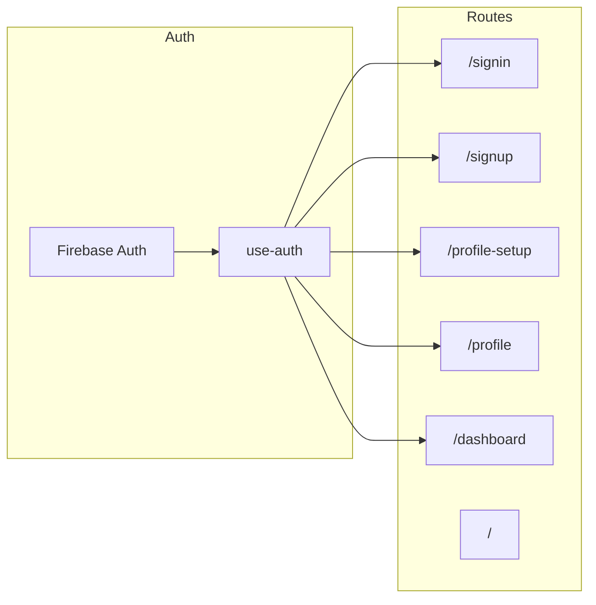

# Auth and Routing Flow Map (Summary)

The full, file-level map lives in **[AUTH_AND_ROUTING_FLOW.md](AUTH_AND_ROUTING_FLOW.md)**. Below is a compact reference for route transitions and where navigation is triggered.

---

## 1. Architecture (current)

- **Auth**: [hooks/use-auth.tsx](../hooks/use-auth.tsx) (Firebase `onAuthStateChanged` + `getUserProfile(uid)`). No Next.js middleware; guards are per-page `useEffect` + `router.push`.
- **Returning vs new**: [lib/firebase.ts](../lib/firebase.ts) `isReturningUser(user)` = `lastSignInTime - creationTime > 60000` ms.

---

## 2. Traced flows

| Flow | Trigger | Route transitions | Navigation source |
|------|--------|-------------------|-------------------|
| **Login** | Sign-in page Google | Success → `redirectTo ?? (returning ? "/dashboard" : "/profile-setup")` | [app/signin/page.tsx](../app/signin/page.tsx) `handleGoogleSignIn`: `router.push(next)` |
| **Login** | Sign-in page Email | Success → `redirectTo ?? "/dashboard"` | [app/signin/page.tsx](../app/signin/page.tsx) `handleSubmit`: `router.push(next)` |
| **Signup** | Sign-up page Google | Success → `returning ? "/dashboard" : "/profile-setup"` | [app/signup/page.tsx](../app/signup/page.tsx) `handleGoogleSignIn`: `router.push(...)` |
| **Signup** | Sign-up page Email | Success → `/profile-setup` | [app/signup/page.tsx](../app/signup/page.tsx) after SignupFlow: `router.push("/profile-setup")` |
| **Profile completion** | Profile-setup "Complete" | Save + optional AstroApp → `/profile` | [app/profile-setup/page.tsx](../app/profile-setup/page.tsx) `handleComplete`: `router.push('/profile')` |
| **Profile edit** | Profile "Save" | No route change | Stays on `/profile` |
| **Profile edit** | Profile "Generate mystical profile" OK | → `/ask-the-seer` (canonical default from [lib/authRouting.ts](../lib/authRouting.ts)) | [app/profile/page.tsx](../app/profile/page.tsx) `router.push(RETURNING_USER_WITH_REPORTS_DESTINATION)` on success |
| **Logout** | Profile or UserMenuDropdown "Sign out" | Full reload → `/` | [lib/firebase.ts](../lib/firebase.ts) `signOutUser`: `window.location.href = '/'` |

---

## 3. Route transitions by user type

| User type | Path |
|-----------|------|
| **Returning** (Google) | Sign-in or sign-up → `/dashboard`; if reports exist (`mysticalProfileGenerated`) → redirect to canonical default `/ask-the-seer` (see [lib/authRouting.ts](../lib/authRouting.ts)). |
| **New** (Google) | Sign-in or sign-up → `/profile-setup` → complete → `/profile`. |
| **New** (Email) | Sign-up → `/profile-setup` → complete → `/profile`. |
| **Edited** | `/profile` → Save → stay on `/profile`; or Generate mystical profile success → `/ask-the-seer`. |

---

## 4. Where navigation is triggered

- **router.push**: Sign-in page (Google/email + `?redirect=`), sign-up page, profile-setup (guard + on complete), profile (guard + after generate), dashboard (guard), hero/how-it-works/sticky-cta, useSubscribe, tool pages, toolRouting, dashboard cards, CompatibilityTab.
- **Guards (useEffect)**: [profile-setup](../app/profile-setup/page.tsx) `if (!user) router.push('/signin')`; if `mysticalProfileGenerated` → canonical default; [profile](../app/profile/page.tsx) and [dashboard](../app/dashboard/page.tsx) `if (!authLoading && !user) router.push("/signin")` (+ return `null` when `!user`); dashboard when `mysticalProfileGenerated` → `router.replace` to [lib/authRouting.ts](../lib/authRouting.ts) canonical default.
- **Full reload**: [lib/firebase.ts](../lib/firebase.ts) `signOutUser`: `window.location.href = '/'` after Firebase signOut and clearing local/cache.

---

## 5. Relation to goal

For **deterministic auth → profile generation → cached reports → controlled API calls → clean deploy**:

- **Auth** is fixed per above (returning vs new, guards, redirect param).
- **Profile generation** is triggered from `/profile` (Generate mystical profile) and post–profile-setup (AstroApp); outcomes and caching live in profile/API layer.
- **Returning users with reports** are always sent to a single canonical default ([lib/authRouting.ts](../lib/authRouting.ts), currently `/ask-the-seer`) from dashboard and profile-setup when `userProfile.mysticalProfileGenerated === true`.
- **Cached reports / API** and **deploy pipeline** are outside this auth/routing map; the full doc is the single place to look for "who goes where after login/signup/profile/logout."
