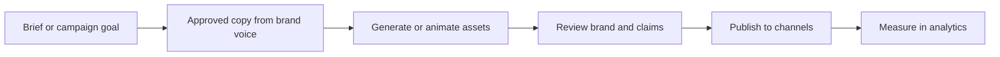

# Marketing and asset workflow

Formal workflow for **being known** (reach + recall): consistent **message**, the right **channels**, sustainable **frequency**, and **assets** accelerated with AI image tools. This doc is for **marketing surfaces** (landing, social, ads, email)—**not** a requirement for the core Next.js app (see [AGENTS.md](../AGENTS.md)).

**Scope boundary:** [Rive](https://rive.app/) / [Spline](https://spline.design/) are optional for **standout motion or 3D on marketing** (site hero, campaign pages, social video). They are **not** required for product features inside the app.

---

## 1. Highest-ROI formula (what to optimize)

| Pillar | What it means for FutureSeer | Success signal |
|--------|------------------------------|----------------|
| **Message** | One clear story: unified divination + grounded AI + saved reports; avoid over-claiming “fortune” | Same elevator pitch everywhere (site, bio, ads) |
| **Channels** | Be present where seekers actually spend time (search, short video, communities, newsletters)—pick **2–3** to start | Traffic and signups from named channels |
| **Frequency** | Show up on a **calendar** (weekly baseline + campaign spikes) | Consistent posts / emails without burnout |
| **Assets** | On-brand visuals fast (see pipeline below) | Cohesive look; faster campaign turnaround |

Tools **do not replace** distribution. They **reduce cost and time** to produce creative once you have a channel strategy.

---

## 2. Roles (who does what)

| Role | Responsibility |
|------|------------------|
| **Owner** | Message, priorities, budget, approval on sensitive copy (spiritual/AI claims) |
| **Marketing / content** | Channel plan, calendar, posting, basic analytics |
| **Design** | Brand kit, templates, MJ/Firefly prompts, Rive/Spline when used |
| **Engineering** | Embed approved assets on **marketing** routes only; performance (LCP, lazy load); **no** coupling of marketing experiments to core divination logic |

If you are a small team, one person may wear multiple hats—still keep **approval** for public claims about readings or AI.

---

## 3. Tools (recommended stack)

| Use | Tools | Notes |
|-----|-------|--------|
| **Static / hero imagery** | Midjourney, Adobe Firefly, or similar | Keep a **prompt library** and **negative prompts** (no misleading “guaranteed” visuals) |
| **Light motion for web/social** | Rive | Export for web/video; keep file sizes small |
| **Simple 3D marketing scenes** | Spline | Embed on landing pages; test mobile performance |
| **Motion in product UI** | Already: **framer-motion**, Tailwind (see codebase)—**not** the same as Rive/Spline |
| **Analytics** | PostHog (see [lib/analytics.ts](../lib/analytics.ts)) | Funnel: awareness → signup → profile → plan |

---

## 4. Folder structure (repo + storage)

Keep marketing assets **out of** hot application paths unless they are shipped as static files.

**In-repo (versioned, small files):**

```
docs/marketing/
  README.md              # optional: links to campaigns
  brand/
    voice-and-claims.md  # approved wording; what we never say
    prompts-mj-firefly.md # image prompt templates (no API keys)
```

**Optional (create when needed):**

```
public/marketing/
  images/                # Web-optimized heroes, og images (WebP)
  video/                 # Short loops if hosted locally (prefer CDN for large files)
```

**Outside repo (typical):** team Drive / Notion / ClickUp for **drafts**, **raw exports**, and **video** too large for git—link from `docs/marketing/README.md` if used.

**Naming:** `YYYY-MM-channel-topic.ext` (e.g. `2026-03-youtube-seer-intro.webp`).

---

## 5. Asset pipeline (deliberate flow)



1. **Brief:** Goal (e.g. “explain mystical profile generation”), audience, single CTA (e.g. signup, pricing).
2. **Copy:** Must align with [DESIGN_PRINCIPLES.md](./DESIGN_PRINCIPLES.md) (trust, no mixed occult systems in marketing claims).
3. **Assets:** MJ/Firefly for stills; Rive/Spline only when motion/3D materially improves clarity or attention.
4. **Review:** Fact-check spiritual wording; avoid deterministic “guaranteed outcomes.”
5. **Publish:** Schedule per channel; use consistent UTM parameters if using ads.
6. **Measure:** Compare periods; tie to HEART “Adoption” where relevant ([HEART_AND_METRICS.md](./HEART_AND_METRICS.md)).

---

## 6. Channel checklist (starter)

Use this as a **template**; edit channels to match your actual strategy.

- [ ] **Owned:** Site landing value prop matches internal docs; `/pricing` clear; SEO titles/descriptions set.
- [ ] **Social:** 2–3 platforms max; bio links to canonical URL; posting rhythm (e.g. 2×/week).
- [ ] **Paid (if any):** Small test budget; landing page matches ad promise; conversion tracking.
- [ ] **Community / PR:** One partnership or guest appearance per quarter (optional).
- [ ] **Email (if list exists):** Monthly digest; no spam; unsubscribe compliant.

---

## 7. Frequency checklist (calendar discipline)

- [ ] **Weekly:** At least one educational or proof-of-value post (tool tip, “how it works,” user-safe testimonial format).
- [ ] **Monthly:** One deeper piece (blog, video, or thread) + review analytics.
- [ ] **Per release:** Note in changelog or short post when UX or tools materially improve.

---

## 8. Asset production checklist (before publish)

- [ ] File format appropriate (WebP/MP4; compress; alt text for images on web).
- [ ] Matches **dual design** intent for **in-app** screenshots: Devotionist web vs Material mobile where shown ([AGENTS.md](../AGENTS.md)).
- [ ] No personal user data in screenshots.
- [ ] Legal: disclaimer visible where required (see [disclaimer](../app/disclaimer/page.tsx) route).

---

## 9. What we explicitly do not require

- Migrating the product to **Webflow** or **Framer** (site builder)—the app is Next.js.
- **Blender** in the pipeline unless you already have 3D expertise; Spline is often enough for simple marketing 3D.
- **After Effects** unless you need broadcast-style video; Rive or simple edits may suffice for social.

---

## Related

- [DEVELOPER_RUNBOOK.md](./DEVELOPER_RUNBOOK.md) — doc index  
- [DESIGN_PRINCIPLES.md](./DESIGN_PRINCIPLES.md)  
- [HEART_AND_METRICS.md](./HEART_AND_METRICS.md)  
- [ROADMAP_PRIORITIZATION.md](./ROADMAP_PRIORITIZATION.md)
