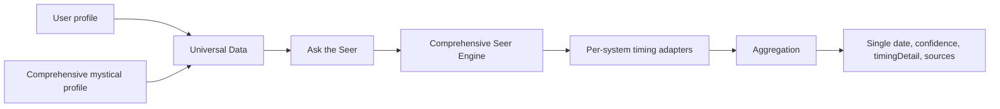

# Multi-System Prediction (FutureSeer USP)

FutureSeer's differentiator: **combine every occult tool and profile data to produce one prediction** (e.g. a single date or insight) and **explain which systems contributed**. A perspective from each system, then a combined response.

## Purpose

- **Single output**: One recommended date, one confidence score, one "See more" explanation.
- **Full transparency**: Which systems were used (Vedic Dashas, Planetary Transits, Numerology, Western Transits, Tarot, BaZi, I Ching, Angel Numbers, KP Astrology, Kabbalistic Numerology, etc.) and what each contributed.
- **Accuracy**: Use deterministic calculations (Vedic, transits, numerology), symbolic systems (Tarot, I Ching, Runes), and optional probabilistic layers (Markov, Bayesian in `lib/predictiveAlgorithms.ts`) to improve consistency and confidence.

## Data flow

1. **User profile** (birth data, name, etc.) and **comprehensive mystical profile** (all tool outputs) are collected into **Universal Data** (`lib/universalDataAggregator.ts`) and optionally cached.
2. When the user asks a **timing question** in Ask the Seer, the **Comprehensive Seer Engine** (`lib/comprehensiveSeerEngine.ts`) runs.
3. **Per-system timing adapters** gather contributions from every available system (Vedic Dashas, Planetary Transits, Numerology, Western Transits, Tarot, BaZi, I Ching, Angel Numbers, KP Astrology, Kabbalistic Numerology).
4. An **aggregator** computes a single recommended date and confidence (e.g. from Vedic `TimingAnalyzer.analyzeYear` when chart data exists, with fallback), and merges in summaries from all other systems.
5. The API returns **single date**, **confidence**, **timingDetail** (how we calculated it), and **sources** / **supportSummaries** (one line per system). The client shows "Confidence + Date + See more" by default; the full narrative and list of sources appear under "See more".

## Systems used for timing

| System | Role | When used |
|--------|------|-----------|
| **Vedic Dashas** | Primary date logic (dasha/antardasha + favorable months) | When `universalData.vedicAstrology.dashas` exists |
| **Planetary Transits** | Favorable/challenging/upcoming transits; supports month choice | When `universalData.vedicAstrology.transits` exists |
| **Numerology** (Chaldean) | Cycles and favorable timing text | When `universalData.chaldeanNumerology.reading.timing` exists |
| **Western Transits** | Favorable windows from Western chart | When Western reading/transits/favorablePeriods exist |
| **Tarot** | Timing or lucky-period narrative | When Tarot reading exists |
| **BaZi** | Favorable period or pillar cycle | When BaZi reading/pillars exist |
| **I Ching** | Timing/change/interpretation text | When I Ching reading exists |
| **Angel Numbers** | Favorable period or timing text | When Angel Numbers reading exists |
| **KP Astrology** | Sub-periods or timing text | When KP reading/dashas exist |
| **Kabbalistic Numerology** | Life cycle / timing overview | When Kabbalistic reading.timing exists |

Goal: **a perspective from each system that has data, then a combined answer** (single date + confidence + "See more" with all sources).

## Accuracy and transparency

- **Deterministic calculations**: Vedic chart, dasha periods, transits, and numerology drive the primary date when birth data is complete; `TimingAnalyzer` (`lib/timingAnalyzer.ts`) scores months by favorability.
- **Symbolic systems**: Tarot, I Ching, Runes, etc. contribute narrative summaries; when they expose timing or favorable-period text, it is included in `supportSummaries` and in "See more".
- **Probabilistic layers**: The codebase includes Markov and Bayesian modules (`lib/predictiveAlgorithms.ts`) and a unified **prediction engine** (`lib/prediction-engine.ts`) that coordinates many systems. The comprehensive Seer can optionally use these for combined timing (e.g. mapping "next 3 months" to a window in the target year) or for refining confidence.
- **Transparency**: `timingDetail` and the "See more" section expose how the date was derived and which systems agreed, so the user sees both the headline (e.g. "88% Confidence, 15 June 2026") and the full reasoning.

## Key files

- **Engine**: `lib/comprehensiveSeerEngine.ts` – `answerTimingQuestion`, `getAdditionalTimingContributions`, aggregation and `timingDetail` / `supportSummaries`.
- **Timing logic**: `lib/timingAnalyzer.ts` – Vedic year/month favorability.
- **Data**: `lib/universalDataAggregator.ts` – Universal divination data; `app/api/seer/query/route.ts` – maps comprehensive profile to engine and returns `timing_window`, `timingDetail`, `supportSummaries`.
- **Client**: `app/ask-the-seer/page.tsx` – Shows "Confidence + Date + See more" by default for timing responses; full narrative and sources inside "See more".
- **Prediction stack**: `lib/prediction-engine.ts`, `lib/predictiveAlgorithms.ts` – Multi-system + Markov/Bayesian combination for possible future integration with Seer timing.

## Optional: README or product copy

You can add one sentence or link: *"Our timing and predictions combine Vedic, Western, Numerology, Tarot, and other systems with transparent aggregation—see [docs/MULTI_SYSTEM_PREDICTION.md](docs/MULTI_SYSTEM_PREDICTION.md)."*
