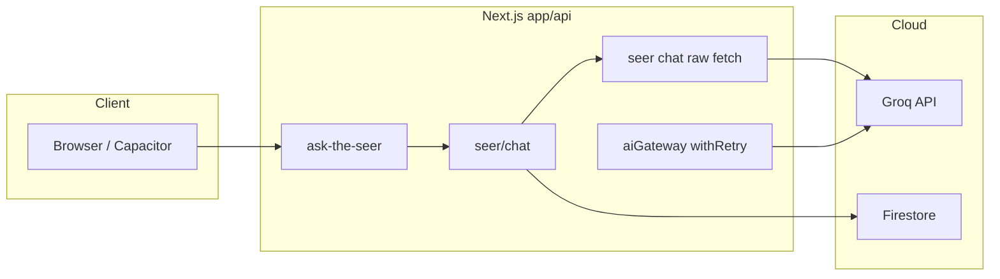

# System design learning applied to FutureSeer

This document implements the roadmap from [KDnuggets: 10 GitHub Repositories to Master System Design](https://www.kdnuggets.com/10-github-repositories-to-master-system-design): those repositories are **study material**, not npm packages. This file turns their themes into **pillars**, **pattern mappings** for our stack, and **ordered, codebase-specific** follow-ups.

## 1. Pillar choice (completed)

| Pillar | Priority | Why here |
|--------|----------|----------|
| **Security / abuse** | Primary | Many routes call Groq and touch user data; cost and reputation risk if endpoints are hammered or spoofed. |
| **Reliability** | Primary | AI provider 429/5xx, serverless cold starts, and long-running profile generation need consistent retries, timeouts, and clear failure modes. |
| **Cost** | Secondary | Firestore reads/writes and Groq tokens scale with traffic; ties to rate limits, caching, and batching. |
| **AI quality / latency** | Secondary | Model choice and streaming already vary by route; improvements are mostly product-tier, not “import a repo.” |

## 2. Patterns mapped to our stack (2–3 core themes)

Themes borrowed from common system-design curricula (e.g. *System Design Primer*–style material cited in the KDnuggets article—not specific to one GitHub repo’s license):

### A. Rate limiting and abuse control

| Concept | FutureSeer reality |
|--------|---------------------|
| Token bucket / fixed window per client | [`lib/rateLimit.ts`](../lib/rateLimit.ts) implements in-memory fixed windows and [`withRateLimit`](../lib/rateLimit.ts). |
| **Gap** | Store is **process-local** (`rateLimitStore`); on Vercel, many instances ⇒ weak global enforcement. |
| **Gap** | `withRateLimit` is applied in practice to [`app/api/openai/route.ts`](../app/api/openai/route.ts) only (grep: `withRateLimit`). High-cost AI routes such as [`app/api/seer/chat/route.ts`](../app/api/seer/chat/route.ts) and most `app/api/ask-*-seer/route.ts` handlers are **not** wrapped. |
| **Gap** | [`withUserRateLimit`](../lib/rateLimit.ts) still uses a placeholder `user-id-from-request` instead of a real user id from auth body/headers. |

### B. Retries, backoff, and idempotency

| Concept | FutureSeer reality |
|--------|---------------------|
| Retry on 429 / 5xx | [`lib/aiGateway.ts`](../lib/aiGateway.ts) `withRetry` wraps Groq/OpenAI SDK calls used by `createAICompletion` / `createAIStream`. |
| **Gap** | [`app/api/seer/chat/route.ts`](../app/api/seer/chat/route.ts) uses **raw `fetch`** to Groq with **no** retry loop; transient 429/502 return 502 immediately. |
| **Gap** | “Fire twice” on flaky clients can duplicate writes unless sensitive routes use idempotency keys (not a universal pattern here yet). |

### C. Authentication boundary

| Concept | FutureSeer reality |
|--------|---------------------|
| Verify caller before expensive work | Many sensitive routes use `getAuth().verifyIdToken(idToken)` (e.g. profile, admin, payments). |
| **Gap** | [`app/api/ask-the-seer/route.ts`](../app/api/ask-the-seer/route.ts) and [`app/api/seer/chat/route.ts`](../app/api/seer/chat/route.ts) accept `userId` (and profile) from JSON **without** verifying a Firebase ID token on those handlers—consistent abuse vector if endpoints are called without the same guarantees as `verifyIdToken` routes. |

## 3. Ordered, codebase-specific fixes

Work top to bottom within each priority band; adjust order if a security review says otherwise.

### P0 — Security / cost exposure

1. **Apply consistent AI rate limits**  
   - Wrap `POST` on [`app/api/seer/chat/route.ts`](../app/api/seer/chat/route.ts) (and/or the proxy [`app/api/ask-the-seer/route.ts`](../app/api/ask-the-seer/route.ts)) with `withRateLimit`, using `rateLimiters.ai` or a stricter dedicated limiter.  
   - Extend the same pattern to other unbounded Groq entry points (representative: `app/api/ask-*-seer/route.ts`) after sampling traffic—avoid one-off limits per file without a shared helper if possible.

2. **Replace or back in-memory limits for production**  
   - Document that [`lib/rateLimit.ts`](../lib/rateLimit.ts) is **best-effort** on serverless until a shared store (e.g. Upstash Redis, Vercel KV, or Firestore-based counters with TTL) exists.  
   - When implementing: keep the same `RateLimiter` API surface to minimize route churn.

3. **Auth for paid/abusable AI**  
   - Require `Authorization: Bearer <Firebase ID token>` on server-side Seer flows and verify with `verifyIdToken`, matching [`app/api/profile/generate-mystical/route.ts`](../app/api/profile/generate-mystical/route.ts) patterns.  
   - Reject or anonymize requests where `userId` in body does not match `decoded.uid`.

### P1 — Reliability

4. **Align Seer chat with gateway retries**  
   - Refactor [`app/api/seer/chat/route.ts`](../app/api/seer/chat/route.ts) to use `createAICompletion` from [`lib/aiGateway.ts`](../lib/aiGateway.ts) (or extract a small `groqChatCompletion` helper that uses the same `withRetry` semantics) instead of raw `fetch`, so 429 gets backoff like other AI routes.

5. **Fix `withUserRateLimit`**  
   - Implement real user extraction from verified token or trusted session in [`lib/rateLimit.ts`](../lib/rateLimit.ts), or remove/export a deprecated wrapper to avoid accidental use.

6. **Timeouts**  
   - Ensure long-running routes (e.g. comprehensive astrology, mystical generation) have explicit `maxDuration` / route segment config where Next.js supports it, and client-side timeouts—cross-check [`docs/FAILURE_TRIAGE.md`](./FAILURE_TRIAGE.md).

### P2 — Observability and cost discipline

7. **Structured metrics**  
   - Centralize logging of Groq usage (already partially logged in Seer chat) and connect to Posthog and Firestore `errorEvents` as described in [CI_AND_STABILITY.md](./CI_AND_STABILITY.md) for anomaly detection.

8. **Firestore read reduction**  
   - Audit hot paths (profile load + tool pages) for redundant `getUserProfile` / collection reads; align with caching patterns from fundamentals material (CDN for static assets, short TTL for semi-static API responses where safe).

9. **ML/agent-specific reading**  
   - For future multi-step agents, use *Machine Learning Systems Design* / *Agentic System Design Patterns*–style checklists (data lineage, eval harnesses, guardrails)—out of scope until orchestration expands beyond single-shot chat.

## 4. How this relates to other audits

- **Occult/astrology correctness:** [ASTROLOGY_ENGINE_AUDIT.md](./ASTROLOGY_ENGINE_AUDIT.md)  
- **Build, CI, env:** [AGENTS.md](../AGENTS.md), [CI_AND_STABILITY.md](./CI_AND_STABILITY.md)  
- **Security commands:** [SECURITY_CHECKS.md](./SECURITY_CHECKS.md)

This file should be updated when P0 items are implemented or superseded (e.g. after adding Redis-backed rate limiting).
