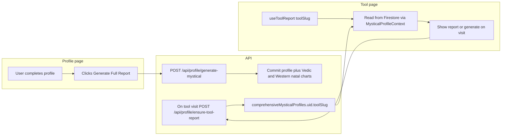

# Study: How Working Tools Show Reports (and How Bazi Should Match)

This document summarizes how **working** tools (Western Astrology, Human Design, Numerology, Ogham, Zi Wei Dou Shu) are designed so Bazi can follow the same pattern.

---

## 1. Data flow (all working tools)

- **Single source of truth:** `comprehensiveMysticalProfiles/{uid}` in Firestore. Each tool’s result is stored under a top-level key matching the tool slug (e.g. `western`, `humanDesign`, `bazi`).
- **Generate on Profile** commits natal charts. Tool pages **read** stored reports and **ensure** the current tool on visit (`POST /api/profile/ensure-tool-report`) if missing.

---

## 2. What makes a tool API “work” (server-safe)

The orchestrator runs in a **server context** and calls each tool’s API with `fetch(baseUrl + '/api/...')`. That API runs on the **server**. So:

- The tool API must **not** import or call anything that is **client-only** (e.g. modules with `'use client'` that use browser APIs or are bundled only for the client).
- If the API needs geocoding, it must use a **server-safe** path:
  - **Option A:** Use a module that works in Node (e.g. no `'use client'`, and `fetch` is available in Node 18+).
  - **Option B:** Resolve coordinates in the API route (e.g. inline `fetch` to Nominatim or `import('@/services/geocoding')` which is used by other API routes) and pass lat/long into the tool logic so the tool never calls client-only geocoding.

**Working examples:**

- **Western:** Orchestrator calls `/api/occult/universal` with `system: 'western'` and `birthData`. That route uses server-side code (e.g. `await import('@/services/geocoding')` for geocoding). Returns `{ chart }`.
- **Human Design:** Orchestrator calls `/api/tools/human-design/generate-report` with `userId`, `userProfile`, `birthData`. API uses server-side code (e.g. `geocodePlace` from `@/services/geocoding`). Returns full report or placeholder.
- **Bazi (after fix):** Orchestrator calls `/api/tools/bazi/analysis` with `userId`, `userProfile`. We use profile from body when present; `lib/geocoding` had `'use client'` removed so `getCoordinatesWithFallback` can run on the server. `baziIntelligence` also uses provided `birthLatitude`/`birthLongitude` when present so it can skip geocoding in API context.

---

## 3. Page structure (consistent pattern)

Working tool pages follow this structure:

| Step | What | Example (Human Design, Ogham, Zi Wei, Western) |
|------|------|--------------------------------------------------|
| 1 | **Auth / profile check** | If no user or missing birth date/time/place, show “Complete profile” and link to profile-setup or /profile. |
| 2 | **ToolReportGuard(loading, error)** | Don’t render main content until loading is done and there’s no guard-level error. |
| 3 | **Single CTA when no report** | If `!hasReport` (and not loading), show one message: “Generate your mystical profile to unlock [Tool]” and one button linking to **/profile**. No on-page “generate this tool” (except Bazi’s temporary “Generate BaZi report now” for debugging). |
| 4 | **Tabs** | Introduction, Report/Chart/Dashboard, Ask the Seer. Report tab content is shown only when there is real report data. |
| 5 | **Report content** | Derive a “report” or “chart” object from `pipelineReport`. Treat **placeholder** as “no report” (so `hasReport` is false or the report object is null when `placeholder === true`). |
| 6 | **Ask the Seer** | Rendered only when there is a valid report; otherwise show the same “generate profile” CTA. |

---

## 4. How each working tool derives “has report”

- **Western:** Uses `analysis` from `westernPipelineReport?.chart` and optional `comprehensiveAnalysis`. Dashboard tab shows content when `analysis?.data` exists; otherwise shows “Generate your mystical profile”. No explicit placeholder check; missing data implies no report.
- **Human Design:** `chart = pipelineReport?.chart`, `report = pipelineReport?.report`, **`hasReport = !!chart && !!report`**. So if the API stored a placeholder (no chart/report), `hasReport` is false. CTA shown when `!hasReport && !isLoading`.
- **Numerology:** `hasReport` from `useToolReport`; `numerologyDataFromReport(pipelineReport)` likely returns null for placeholder. “Complete profile” when missing birth details; then CTA when no report.
- **Ogham:** `report = raw?.report ?? (pipelineReport if not placeholder)`. Explicit: `!(pipelineReport && 'placeholder' in pipelineReport)`. CTA when `!hasReport && !isGeneratingReport && !error`.
- **Zi Wei Dou Shu:** `ziweiReport = pipelineReport` with `raw.placeholder === true` → null. So `hasReport` can be true from hook but `ziweiReport` null when placeholder; chart/report tabs then show “Generate your mystical profile”.

So either:

- **Option A:** Define `hasReport` as “we have real data” (e.g. Human Design: `hasReport = !!chart && !!report`), so placeholder is automatically “no report”, or  
- **Option B:** Keep `hasReport` from the hook but treat placeholder explicitly (e.g. Ogham, Zi Wei, Bazi): if `pipelineReport?.placeholder === true`, treat as no report and show CTA.

---

## 5. Bazi alignment checklist

- **Pipeline:** Bazi is in `ALL_TOOL_SLUGS`; orchestrator calls `POST /api/tools/bazi/analysis` with `userId` and `userProfile`. **Done.**
- **API server-safe:** Use profile from request body when present; use `lib/geocoding` only after removing `'use client'`; use `birthLatitude`/`birthLongitude` when available so Bazi doesn’t need to call geocoding on the server. **Done.**
- **Storage:** Orchestrator stores result in `comprehensiveProfile.bazi`; page reads via `useToolReport('bazi')`. **Done.**
- **Page structure:** ToolReportGuard, profile complete check, then either CTA or tabs (Introduction, Your Report, Ask the Seer). **Done.**
- **Placeholder = no report:** Bazi page treats `placeholder === true` as no report (`baziReport` null, `isPlaceholderReport` true), shows CTA and optionally “what we have stored” for debugging. **Done.**
- **Optional simplification:** Once Bazi API is stable, the Bazi page can be simplified to match Ogham/Human Design: single “Generate your mystical profile” CTA when no report (or placeholder), no “Generate BaZi report now” or “What we have stored” unless you want to keep them as power-user/debug features.

---

## 6. Files reference

| Concern | File(s) |
|--------|---------|
| Orchestrator (who calls which API) | `lib/profileGenerationOrchestrator.ts` |
| Storing pipeline result | `app/api/profile/generate-mystical/route.ts` |
| Reading on the client | `contexts/MysticalProfileContext.tsx`, `hooks/useComprehensiveMysticalProfile.tsx` |
| Western (working) | `app/tools/western-astrology/page.tsx`, `/api/occult/universal` |
| Human Design (working) | `app/tools/human-design/page.tsx`, `app/api/tools/human-design/generate-report/route.ts` |
| Ogham (working) | `app/tools/ogham/page.tsx` – explicit placeholder check |
| Zi Wei (working) | `app/tools/ziwei-dou-shu/page.tsx` – placeholder → null report |
| Bazi | `app/tools/bazi/page.tsx`, `app/api/tools/bazi/analysis/route.ts`, `lib/baziIntelligence.ts`, `lib/geocoding.ts` |

---

## 7. Summary

Working tools: (1) get data only from the pipeline (Profile → Generate → orchestrator → tool API → Firestore); (2) use server-safe tool APIs (no client-only code); (3) show one “Generate your mystical profile” CTA when there’s no report (or placeholder); (4) render report tabs only when real data exists. Bazi is aligned with this after the geocoding fix and profile-from-body; the only extra on the Bazi page is the optional “Generate BaZi report now” and “What we have stored” for debugging, which can stay or be removed for a simpler, Ogham-style UX.
